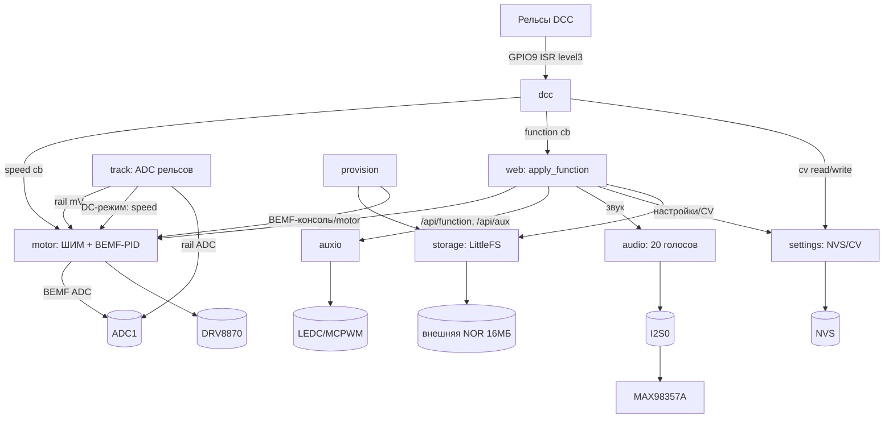

# ADDITIPUS AURA-X (Soft_Decoder_V3) — аппаратно-программная архитектура

Референс-документ по прошивке `firmware/`. Содержит всё, что нужно, чтобы
без «раскопок» вносить доработки: состав железа, карту выводов, распределение
периферии и памяти, список задач, компоненты и их взаимодействие, настройки,
REST API и ресурсы.

Версия прошивки: **0.8** (`version.txt` — единственный источник; попадает в
веб-страницу, CV7 и OTA-образ).
Целевой модуль сборки: `esp32-s3-devkitc-1` (PlatformIO), фреймворк ESP-IDF
`5.1.4`. Язык: C (C11), без C++.

---

## 1. Что это за устройство

DCC-декодер для модели железной дороги с:

- приёмом DCC с рельсов (GPIO-вход, программный разбор полупериодов);
- управлением двигателем (DRV8870, ШИМ + регулирование по противо-ЭДС/BEMF);
- до 20 звуковых голосов (I2S → MAX98357A), звуки лежат на внешней NOR;
- 9 световых/AUX-выходами (F0F, F0R, AUX1..AUX7) с эффектами;
- веб-интерфейсом (точка доступа Wi-Fi + встроенная страница + REST API);
- хранением настроек в NVS, звуков — в LittleFS на внешней NOR;
- обновлением по OTA и «провижинингом» звуков по UART.

Управление может идти либо с рельсов (DCC), либо из веба
(`control_source`), либо — для рельсов — в DCC- или DC-режиме (CV29 бит 2).

---

## 2. Аппаратная платформа

### 2.1 Микроконтроллер

| Параметр | Значение |
|---|---|
| МК | ESP32-S3FH4R2 (по мастер-документу, `pinmap.h:6`) |
| Ядра | 2 × Xtensa LX7 |
| Тактовая частота | **160 МГц** (`CONFIG_ESP_DEFAULT_CPU_FREQ_MHZ=160`; 240 доступно, не используется ради нагрева/потребления) |
| Встроенная flash | **4 МБ** (`CONFIG_ESPTOOLPY_FLASHSIZE_4MB=y`, `board_build.flash_size=4MB`) |
| Встроенная PSRAM | **2 МБ, включена** как heap (quad, 80 МГц; `CONFIG_SPIRAM=y`) |
| Пакет сборки PlatformIO | `esp32-s3-devkitc-1` (совместимый «декит-профиль»; микросхема на плате — S3FH4R2) |
| Режим загрузки flash | DIO @ 80 МГц |

> Важно: PlatformIO при сборке печатает «ESP32-S3-DevKitC-1-N8 (8 MB QD, No
> PSRAM)» — это описание профиля платы, а не фактического чипа. Ограничение
> размера приложения задаёт `board_build.flash_size = 4MB` и таблица разделов.

### 2.2 Питание, сброс, защита

- Brownout-детектор ESP-IDF включён (уровень 7). При просадке питания на
  старте двигателя в логе будет `BROWNOUT` в `esp_reset_reason()`.
- Аппаратная защита по току: `PIN_CURRENT_SENSE` (GPIO7) — вход внешнего
  компаратора; **кодом не читается** (защита чисто аппаратная).
- Core dump включён в отдельный раздел (`CONFIG_ESP_COREDUMP_ENABLE_TO_FLASH=y`).
- OTA rollback включён (`CONFIG_BOOTLOADER_APP_ROLLBACK_ENABLE=y`): новая
  прошивка стартует как PENDING_VERIFY и подтверждается в конце `app_main`
  (`esp_ota_mark_app_valid_cancel_rollback()`); аварийный старт откатывает её.
- Power management выключен: light sleep «усыплял» бы радио AP
  (загрузка падала до ~2 КБ/с), см. `sdkconfig.defaults`.

### 2.3 Карта выводов (`components/pinmap/include/pinmap.h`)

| GPIO | Обозначение | Назначение |
|---|---|---|
| 12 | `PIN_MOTOR_IN1` | Драйвер двигателя DRV8870, IN1 (PWM, LEDC ch0) |
| 11 | `PIN_MOTOR_IN2` | Драйвер двигателя DRV8870, IN2 (PWM, LEDC ch1) |
| 9 | `PIN_DCC_IN` | DCC-сигнал с рельсов (вход, прерывание по фронту) |
| 3 | `PIN_ACK_LOAD` | Service-mode ACK (импульс ~6 мс, NMRA) |
| 4 | `PIN_BEMF1` | ADC1_CH3 — ЭДС двигателя, плечо 1 |
| 5 | `PIN_BEMF2` | ADC1_CH4 — ЭДС двигателя, плечо 2 |
| 6 | `PIN_RAIL_SENSE` | ADC1_CH5 — делитель напряжения рельсов |
| 7 | `PIN_CURRENT_SENSE` | Вход аппаратной защиты по току (не используется кодом) |
| 34 | `PIN_AUDIO_BCLK` | I2S BCLK (MAX98357A) |
| 35 | `PIN_AUDIO_WS` | I2S WS/LRCK |
| 33 | `PIN_AUDIO_DOUT` | I2S данные |
| 37 | `PIN_AUDIO_SD_MODE` | MAX98357A SD_MODE: держится в 1 (усилитель включён) |
| 13 | `PIN_STORAGE_CS` | CS внешней NOR (SPI2) |
| 16 | `PIN_STORAGE_SCK` | SCK внешней NOR |
| 15 | `PIN_STORAGE_MOSI` | MOSI внешней NOR |
| 14 | `PIN_STORAGE_MISO` | MISO внешней NOR |
| 10 | `PIN_AUX_F0F` | Передний свет (LEDC ch2) |
| 46 | `PIN_AUX_F0R` | Задний свет (LEDC ch3) |
| 41 | `PIN_AUX1` | AUX1 (LEDC ch4) |
| 40 | `PIN_AUX2` | AUX2 (LEDC ch5) |
| 1 | `PIN_AUX3` | AUX3 (LEDC ch6) |
| 36 | `PIN_AUX4` | AUX4 (LEDC ch7) |
| 42 | `PIN_AUX5` | AUX5 (MCPWM0A) |
| 39 | `PIN_AUX6` | AUX6 (MCPWM0B) |
| 38 | `PIN_AUX7` | AUX7 (MCPWM1A) |
| 17 | `PIN_I2C_SDA` | I2C SDA — **зарезервирован, кодом не используется** |
| 18 | `PIN_I2C_SCL` | I2C SCL — **зарезервирован, кодом не используется** |

`pinmap_validate()` (`components/pinmap/src/pinmap.c`) проверяет, что среди
используемых выводов нет недоступных на ESP32-S3 GPIO22/23/24/25, нет значений
вне 0..48 и нет дублей. Вызывается первым делом в `app_main`.

### 2.4 Распределение периферийных блоков

| Блок ESP32-S3 | Что занимает | Параметры |
|---|---|---|
| LEDC timer 0, каналы 0–1 | Мотор (IN1/IN2) | 10 бит, 20 кГц |
| LEDC timer 1, каналы 2–7 | F0F, F0R, AUX1..AUX4 | 8 бит, 20 кГц |
| MCPWM unit 0, timer 0 (op A/B) | AUX5, AUX6 | 20 кГц |
| MCPWM unit 0, timer 1 (op A) | AUX7 | 20 кГц |
| I2S0 (TX, master) | Аудио → MAX98357A | 16 бит, моно, 22050 Гц |
| ADC1 | BEMF1/BEMF2/RAIL_SENSE | 12 бит, atten 12 дБ (0…~3.1 В) |
| SPI2_HOST | Внешняя NOR W25Q128 | 40 МГц, Fast Read |
| Wi-Fi radio | SoftAP | канал 1/6/11, WPA2/Open |
| GPIO ISR (level 3) | DCC-вход (GPIO9) | ANYEDGE, сервис ставится на CPU1 |

Почему AUX5..AUX7 на MCPWM: у ESP32-S3 всего 8 каналов LEDC, из них 0–1 заняты
мотором; 6 каналов (2–7) уходят на F0F/F0R/AUX1..AUX4, остальные три выхода
сделаны на MCPWM.

---

## 3. Память и разделы

### 3.1 Внутренняя flash 4 МБ (`partitions.csv`)

| Раздел | Тип | Смещение | Размер | Назначение |
|---|---|---|---|---|
| `nvs` | data/nvs | 0x009000 | 64 КБ | настройки, CV и пр. |
| `phy_init` | data/phy | 0x019000 | 4 КБ | калибровка RF |
| `otadata` | data/ota | 0x01A000 | 8 КБ | выбор OTA-слота |
| `ota_0` | app | 0x020000 | 1920 КБ | приложение (текущий образ) |
| `ota_1` | app | 0x200000 | 1920 КБ | приложение (OTA-приёмник) |
| `coredump` | data/coredump | 0x3E0000 | 128 КБ | core dump |

Таблица разделов на смещении 0x8000 (`CONFIG_PARTITION_TABLE_OFFSET`). Между
`otadata` (конец 0x01C000) и `ota_0` (0x020000) — выравнивающая пауза 16 КБ.
Внутреннего `userdata`/fallback **нет**: звуки хранятся только на внешней NOR;
без неё устройство работает с отключённым звуком.

### 3.2 Внешняя NOR 16 МБ

- Микросхема W25Q128 (16 МБ) на SPI2 (GPIO13/16/15/14), 40 МГц.
- Регистрируется как раздел с меткой `ext_userdata` на весь объём
  (`components/storage/src/storage.c`, `EXT_PARTITION_SIZE = 16 МБ`).
- Форматируется в **LittleFS** и монтируется в `/userdata`.
- Если внешняя NOR не отвечает или mount не удался — прошивка **не форматирует**
  её автоматически (чтобы не потерять звуки) и продолжает работу с отключённым
  звуком (внутреннего fallback нет). Backend смотрится в `storage_get_backend()`
  (`STORAGE_BACKEND_EXTERNAL_NOR`/`STORAGE_BACKEND_NONE`) и выводится в лог.
- Формат внешней NOR выполняется только явно — при провижининге
  (`storage_format()`).

### 3.3 NVS

Пространство имён `decoder`. Legacy-ключ `cv` хранит блоб `SETTINGS_CV_COUNT+1 =
513 байт` + CRC32 (`cv_crc`). Остальные ключи — `components/settings/src/settings.c`.

Рядом со звуками на внешней NOR лежит **манифест** `/userdata/audio/tracks.txt`
(список слотов + карта F↔AUX). Он перезаписывается при любом изменении этих
метаданных и читается при пустом NVS — так имена, категории и карта F↔AUX
переживают полный сброс (см. §15).

### 3.4 RAM

- Встроенная SRAM ESP32-S3 — 512 КБ, из них под приложение доступно
  ~320 КБ DRAM (PlatformIO считает от 327 680 Б).
- **PSRAM 2 МБ включена** (`CONFIG_SPIRAM=y`, quad, 80 МГц) и отдаётся в heap:
  крупные аллокации уходят в PSRAM, мелкие остаются во внутренней DRAM.
- Точные цифры — в разделе 17.

---

## 4. Программная среда и инструменты

### 4.1 Стек

| Слой | Версия/инструмент |
|---|---|
| SDK | ESP-IDF **5.1.4** (`dependencies.lock`) |
| ОСРВ | FreeRTOS (в составе IDF), тик 1000 Гц (`CONFIG_FREERTOS_HZ=1000`) |
| Сборщик | PlatformIO (`platformio.ini`), CMake + Ninja |
| Компилятор | `xtensa-esp32s3-elf-gcc` (GCC 12.2) |
| Оптимизация | `-Os` (`CONFIG_COMPILER_OPTIMIZATION_SIZE`), `newlib` nano |
| Хранилище | esp_littlefs (вкомпилированный компонент) |
| Веб-сервер | esp_http_server |
| Сеть | esp_wifi (SoftAP-only), lwIP, esp_netif |
| Core dump | espcoredump → flash |

Зависимости компонентов заданы в `components/*/CMakeLists.txt` (см. раздел 6).

### 4.2 Сборка и прошивка

`platformio.ini`:

```
[env:esp32-s3-devkitc-1]
platform = espressif32
framework = espidf
board = esp32-s3-devkitc-1
board_build.partitions = partitions.csv
board_build.flash_size = 4MB
extra_scripts = pre:tools/gen_web_html.py
src_dir = main
```

Команды (PlatformIO лежит в `%USERPROFILE%\.platformio\penv\Scripts`):

```
pio run -e esp32-s3-devkitc-1                 # сборка
pio run -e esp32-s3-devkitc-1 -t upload --upload-port COMx   # прошивка
pio run -e esp32-s3-devkitc-1 -t size         # размер образа
```

Готовые bat/ps1-обёртки в корне `firmware/`:

| Скрипт | Назначение |
|---|---|
| `flash_firmware.bat [COMx] [erase]` | Сборка + прошивка по UART/USB-JTAG (автопоиск порта). `erase` — полная очистка чипа (стирает NVS); без него настройки сохраняются |
| `flash_firmware_and_sounds.bat [COMx] [erase]` | Прошивка + заливка звуков на внешнюю NOR (внешняя NOR всегда стирается; `erase` дополнительно чистит внутреннюю flash/NVS) |
| `build_ota_bin.bat` | Сборка и копирование OTA-образа в `../release/ADDITIPUS_AURA-X_v<ver>.bin` |
| `build_flash_tool_files.bat` | Файлы для Espressif Flash Download Tool + генерация `README.txt` из `partitions.csv` |
| `build_ota_with_sounds.ps1` | Сборка составного OTA-контейнера (прошивка + звуки) |
| `provision_sounds.ps1` | Заливка звуков по UART (протокол провижининга) |
| `read_bemf.ps1` | Чтение коэффициентов BEMF по UART, опц. запись в `bemf_cal_base.h` |
| `bump_version.bat` / `tools/bump_version.ps1` | Инкремент версии в `version.txt` |

### 4.3 Генерация веб-страницы

`tools/gen_web_html.py` запускается как `pre:`-скрипт PlatformIO:

- читает `firmware/web_ui.html` (единственный источник страницы);
- вырезает HTML-комментарии, схлопывает переводы строк и пробелы (безопасный
  сабсет — в исходнике нельзя использовать `//`-комментарии JS, многострочные
  шаблонные литералы и двойные пробелы внутри строк);
- подставляет `__VERSION__` из `version.txt`;
- пишет `components/web/include/web_html.h` (`s_page_html[]` + `WEB_FW_VERSION`);
- перезаписывает файл только при реальном изменении, чтобы не пересобирать `web.c`.

> Правите веб-интерфейс **только** в `web_ui.html`, не в `web_html.h`.

### 4.4 Нативные тесты (без железа)

`test/run_tests.ps1` собирает тест-наборы обычным `gcc` (или TCC) вместе с
Unity и гоняет на ПК. Компоненты подключаются «белым ящиком» (`#define static`
снимается вокруг include `.c`), ESP-IDF подменяется заглушками в
`test_libs/teststubs/`.

```
powershell -ExecutionPolicy Bypass -File test\run_tests.ps1
powershell -ExecutionPolicy Bypass -File test\coverage.ps1            # gcov, union по строкам
powershell -ExecutionPolicy Bypass -File test\coverage.ps1 -Only test_web
```

Наборы (14): `test_dcc`, `test_settings`, `test_motor`, `test_auxio`,
`test_web_util`, `test_track`, `test_audio`, `test_pinmap`,
`test_track_manifest`, `test_storage`, `test_track_recover`, `test_provision`,
`test_selftest`, `test_web`. Всего **471 тест**; покрытие first-party
(`components/` + `main/`) — **100 % строк** (union по строкам, gcov; ~4400 строк).

При добавлении нового набора обновляйте `$inc` (include-пути) и `$suites` в
ОБОИХ скриптах (`run_tests.ps1`, `coverage.ps1`). Частично исполненные строки
(gcov `N*`) считаются покрытыми. Опциональный `-Sanitize` (ASan/UBSan) — для
Linux/CI.

Заглушки с инъекцией отказов (`test_libs/teststubs/stubs.c`): `mock_sem_take_fail`,
`mock_mutex_create_fail`, `mock_nvs_*`, `mock_task_create_*`, `mock_adc1_config_*`,
`mock_i2s_*`, `mock_queue_*`, `mock_gpio_isr_install_err`, `mock_uart_*`,
`mock_usbjtag_*`, `mock_ota_*`, `mock_spi_*`, `mock_flash_*`, `mock_lfs_*`,
`mock_partition_register_err`, а также `mock_timer_now_us`/мок UART
(`mock_uart_feed`/`mock_uart_tx`/`mock_uart_reset`). Для `test_web` дополнительно
`web_stubs.c`: host-shim `esp_http_server` (скриптованные запросы, захват
ответа, таблица маршрутов), заглушки `esp_wifi`/`esp_netif`/`esp_event`/`lwip`,
инъекция OOM (`mock_web_malloc/calloc`) и отказов `fsync`/`fwrite`/`fflush`/
`fclose`.

Тест-хуки в коде для ограничения бесконечных циклов (в проде = 0, «вечно»):
`s_iter_cap` (track), `s_fx_iter_cap` (auxio), `s_mix_iter_cap` (audio),
`s_motor_iter_cap` (motor), `s_dcc_iter_cap`/`s_ack_iter_cap` (dcc),
`s_listen_iter_cap` (provision),
`s_autooff_iter_cap`/`s_dns_iter_cap`/`s_pipe_iter_cap` (web). Переопределяемые
для host пути: `MANIFEST_DIR` (track_manifest), `STORAGE_MOUNT_POINT` (storage),
`PROV_AUDIO_DIR`/`PROV_MKDIR` (provision), `WEB_USERDATA_DIR`/`WEB_AUDIO_DIR`
(web), `SELFTEST_TMP_PATH` (selftest).

HIL по железу (нужна подключённая плата): `test/hil/run_hil.ps1` шлёт
`SELFTEST` через USB-Serial-JTAG/UART0 и парсит `TEST <name> PASS|FAIL|SKIP`;
с `-Actuate` проверяет AUX и звук, `-Sweep` — все F0..F28 и все AUX,
`-MotorSpeed N` — мотор. `test/hil/run_hil_web.ps1` дополнительно прогоняет
веб/REST-эндпоинты через SoftAP (при заданном пароле — параметр `-ApPass`).
См. §6 `selftest` и §16.

---

## 5. Структура проекта

```
firmware/
├─ platformio.ini            конфигурация сборки
├─ partitions.csv            таблица разделов
├─ sdkconfig.defaults        базовые настройки IDF
├─ sdkconfig.esp32-s3-...    итоговый sdkconfig (генерируется)
├─ version.txt               версия для сборки (единственный источник)
├─ CMakeLists.txt            project(soft_decoder_v3)
├─ web_ui.html               исходник веб-страницы (single-file)
├─ ARCHITECTURE.md           референс-документ (этот файл)
├─ main/
│  ├─ CMakeLists.txt
│  └─ app_main.c             точка входа, колбэки DCC, safety-задача
├─ components/
│  ├─ pinmap/                карта выводов + валидация
│  ├─ settings/              NVS: конфиг, CV, треки, карты, AUX, BEMF + манифест метаданных
│  ├─ storage/               LittleFS: внешняя NOR (без внутреннего fallback)
│  ├─ dcc/                   разбор DCC, service/ops mode, consist
│  ├─ motor/                 DRV8870 ШИМ + BEMF-PID + калибровка
│  ├─ track/                 рельсовый ADC, DC-режим
│  ├─ audio/                 20-голосый микшер → I2S
│  ├─ auxio/                 9 световых выходов + эффекты
│  ├─ web/                   Wi-Fi AP, HTTP, REST API, журнал, веб-контент
│  ├─ provision/             UART-провижининг звуков, BEMF-консоль
│  ├─ selftest/              встроенный SELFTEST (консоль) для HIL по USB
│  └─ esp_littlefs/          сторонний компонент LittleFS
├─ tools/                    gen_web_html.py, bump_version.ps1
├─ test/                     нативные тесты + run_tests.ps1
├─ test_libs/teststubs/      заглушки ESP-IDF для тестов
└─ *.bat / *.ps1             скрипты сборки/прошивки/провижининга
```

В **корне репозитория** (`Soft_Decoder_V3/`): `VERSION` (версия проекта),
`CHANGELOG.md` (хронология; строка за коммит добавляется автоматически хуком),
`.githooks/` + `setup_git_hooks.bat` (git-хуки), `release/`, `web_flasher/`.

---

## 6. Компоненты прошивки

Каждый компонент — статическая библиотека ESP-IDF. Ниже: назначение, ключевые
файлы/API, зависимости (из `CMakeLists.txt`), создаваемые задачи.

### pinmap
- Файлы: `src/pinmap.c`, `include/pinmap.h`.
- Роль: все номера GPIO в одном месте + `pinmap_validate()`.
- Зависимости: нет. Задачи: нет.

### settings (`components/settings`)
- Файлы: `src/settings.c`, `src/track_manifest.c`, `include/settings.h`.
- Роль: NVS-хранилище: конфиг устройства, CV-блок (513 Б + CRC32 FNV-1a),
  список треков, категории слотов, карта функций, конфиг AUX, калибровка BEMF и
  флаг включения BEMF. Отложенная запись (`settings_save_deferred` + фоновый
  `settings_pending_flush`) защищает flash/радио от частых коммитов.
  `track_manifest.c` дублирует список треков + карту F↔AUX в
  `/userdata/audio/tracks.txt` и восстанавливает их при пустом NVS.
- API: `settings_load/save`, `settings_cv_*`, `settings_tracks_*`,
  `settings_track_cats_*`, `settings_func_map_*`, `settings_aux_cfg_*`,
  `settings_bemf_cal_*`, `settings_bemf_use_*`, `settings_factory_reset`,
  `settings_manifest_sync/load`.
- Зависимости: `nvs_flash`, `esp_timer`. Задачи: нет (синхронно).

### storage (`components/storage`)
- Файлы: `src/storage.c`, `include/storage.h`.
- Роль: регистрация внешней SPI-NOR как `ext_userdata`, LittleFS-монтирование в
  `/userdata`, форматирование, бенчмарк, `storage_get_free_bytes()`. Внутреннего
  fallback нет: без внешней NOR `storage_mount()` возвращает ошибку, но не
  фатален (`STORAGE_BACKEND_NONE`), звук просто отключён.
- API: `storage_init/mount/format`, `storage_get_backend`, `storage_get_free_bytes`.
- Зависимости: `spi_flash esp_partition esp_littlefs vfs driver nvs_flash pinmap esp_timer`.
- Задачи: нет.

### dcc (`components/dcc`)
- Файлы: `src/dcc.c`, `include/dcc.h`.
- Роль: разбор DCC из полупериодов. ISR level-3 на GPIO9 кладёт длительности
  полупериодов в очередь (256); задача `dcc_task` (CPU1, prio 10) собирает
  пакеты: адресация, скорость 14/28/128, функции F0..F28, Service Mode
  (Direct/Bit), Ops Mode, consist CV19, broadcast reset/estop, таймаут по CV11.
  Наружу — колбэки (скорость, функция, запись/чтение CV, reset).
- API: `dcc_init`, `dcc_set_address/speed_step_mode/consist`, `dcc_reload_config`,
  `dcc_register_*_cb`, `dcc_last_packet_us`, `dcc_service_ack`.
- Зависимости: `driver esp_timer pinmap`.
- Задачи: **`dcc`**, стек 8192, prio 10, ядро 1; **`dcc_ack`**, стек 2048,
  prio 5 — выдаёт импульс service-mode ACK, чтобы задача разбора не блокировалась
  на 6 мс; пин ACK конфигурируется один раз в `dcc_init()`.

### motor (`components/motor`)
- Файлы: `src/motor.c`, `include/motor.h`, `include/bemf_cal_base.h`.
- Роль: ШИМ мотора, разгон/торможение CV3/CV4, кикстарт CV65, кривая скорости
  CV2/CV5/CV6 или таблица CV67..94, измерение BEMF в «окне выбега» и PID-регулятор
  (CV54/55/56) с целью по калибровочной кривой; калибровка BEMF (прогон без
  нагрузки), флаг включения BEMF.
- API: `motor_init`, `motor_set_speed`, `motor_stop`, `motor_get_status`,
  `motor_set_rail_voltage_mv`, `motor_bemf_lock/unlock`,
  `motor_bemf_cal_*`, `motor_set/get_bemf_enabled`, `motor_bemf_diag`,
  `motor_bemf_adc_dump`, `motor_bemf_coast_read`.
- Зависимости: `driver pinmap settings`.
- Задачи: **`motor`** (стек 3072, prio 7, период 10 мс), **`bemf_cal`**
  (стек 3072, prio 6) — создаётся по запросу калибровки.

### track (`components/track`)
- Файлы: `src/track.c`, `include/track.h`.
- Роль: непрерывно читает `PIN_RAIL_SENSE` (ADC1), кормит `motor_set_rail_voltage_mv()`
  и, в DC-режиме с управлением «Рельсы», задаёт скорость/направление по
  напряжению и полярности рельсов.
- Зависимости: `driver settings motor web`.
- Задачи: **`track_adc`**, стек 3072, prio 7, период 50 мс.

### audio (`components/audio`)
- Файлы: `src/audio.c`, `include/audio.h`.
- Роль: 20-голосый микшер. Один I2S-канал на фиксированной частоте 22050 Гц
  моно; голоса читают WAV (моно/стерео, любой sample rate), линейно
  ресемплируются, суммируются с громкостями и ограничиваются. Открытие/закрытие
  файлов — только в задаче микшера через очередь запросов под мьютексом.
- API: `audio_init`, `audio_voice_play/stop`, `audio_stop_all`,
  `audio_set/get_volume`, `audio_is_playing`, `audio_validate_wav`.
- Зависимости: `driver pinmap esp_timer`.
- Задачи: **`audio_mix`**, стек 4096, prio 7, ядро 1 (блок 256 сэмплов ≈ 11.6 мс).

### auxio (`components/auxio`)
- Файлы: `src/auxio.c`, `include/auxio.h`.
- Роль: 9 выходов (F0F, F0R, AUX1..AUX7) на LEDC/MCPWM, 8-битная гамма-таблица,
  эффекты: steady, incandescent, Mars, ditch, beacon, strobe, firebox.
- API: `auxio_init`, `auxio_set_enabled`, `auxio_set_output`,
  `auxio_set_effect`, `auxio_config`, `auxio_get_enabled`.
- Зависимости: `driver pinmap`.
- Задачи: **`aux_fx`**, стек 3072, prio 6, период 20 мс.

### web (`components/web`)
- Файлы: `src/web.c`, `src/web_util.c`, `include/web.h`, `include/web_util.h`,
  `include/web_html.h` (генерируется).
- Роль: Wi-Fi SoftAP (скан канала 1/6/11, авто-выключение), два HTTP-сервера
  (80 — страница+API, 81 — прогресс загрузки), DNS-хайджек для captive portal,
  REST API, журнал событий (`/api/log`), OTA, аплоад/удаление звуков,
  применение функций/AUX/звуков, громкости.
- Зависимости: `esp_http_server esp_wifi esp_netif esp_event esp_timer app_update
  nvs_flash driver audio auxio motor settings storage pinmap dcc`.
- Задачи (создаются в `web.c`/`httpd`):
  - **`dns_hijack`** (стек 4096, prio 9),
  - **`wifi_off`** (стек 3072, prio 4) — при `auto_off_min ≠ 0`,
  - **`pipe_wr`** (стек 16384, prio 10, ядро 1) — на время загрузки файла,
  - HTTP-задачи создаёт `esp_http_server`: основной сервер (стек 16384) и
    progress-сервер (стек 4096).

### selftest (`components/selftest`)
- Файлы: `src/selftest.c`, `include/selftest.h`.
- Роль: встроенный самотест, запускаемый командой `SELFTEST` по UART/USB
  (обрабатывается консолью `provision`). Проверки **неразрушающие**: heap,
  pinmap, CV-хранилище (границы `settings_cv_read`), NVS (scratch-ключ),
  LittleFS (scratch-файл), ADC-путь, громкость аудио, состояние AUX, DCC-API.
  Мотор, звук и персистентные настройки не затрагиваются.
- API: `selftest_run()` (заполняет `selftest_report_t`), `selftest_state_name()`
  и act-команды `selftest_act_aux()/act_sound()/act_motor()/act_function()` плюс
  прогоны `selftest_act_fn_sweep()` (все F0..F28) и `selftest_act_aux_sweep()`
  (все 9 AUX). Активация ограничена по времени, по завершении возвращается
  прежнее состояние AUX / останавливаются звук и мотор.
- `selftest_act_function()` вызывает тот же `web_apply_function()`, что и кнопки
  F в веб-UI и DCC, поэтому прогон F проверяет реальную цепочку маппинга.
- Консольные команды: `SELFTEST` (read-only отчёт) и `HIL-AUX <ch> <ms>`,
  `HIL-SOUND <slot> <ms>`, `HIL-MOTOR <spd> <ms>`, `HIL-FN <fn> <0|1>`,
  `HIL-FN-SWEEP <ms>`, `HIL-AUX-SWEEP <ms>` (ответы `HIL-*-OK` / `HIL-*-ERR`).
- Зависимости: `pinmap settings storage motor audio auxio dcc web nvs_flash esp_system`.
- Задачи: нет (выполняется в задаче `prov_listen`).
- Формат вывода и host-runner: `test/hil/run_hil.ps1` (см. §16).

### provision (`components/provision`)
- Файлы: `src/provision.c`, `include/provision.h`.
- Роль: (1) приём `PROV` по UART0/USB-JTAG в первые ~8 с после старта → стирание
  внешней NOR, приём WAV по протоколу `PUT <slot> <size> <label>` + ACK, перезагрузка;
  (2) UART-консоль BEMF: `BEMF?`, `BEMF-HDR`, `BEMF=…`, `BEMF-RAW`, `BEMF-ADC`,
  `BEMF-COAST`, `BEMF-TEST`, `BEMF-CAL`, `BEMF-CLR`, `BEMF-CVSET`.
- Зависимости: `driver esp_timer esp_system app_update settings storage motor`.
- Задачи: **`prov_listen`**, стек 8192, prio 4.

### app_main (`main/app_main.c`)
- Порядок старта: `pinmap_validate` → `motor_boot_safe` → `storage_init/mount`
  (не фатально: без внешней NOR звук отключён) → `settings_init` → `provision_try` →
  `motor_init` → `audio_init` → `dcc_init` + регистрация колбэков → `web_init` →
  восстановление метаданных (манифест, иначе из имён файлов) → `track_init` →
  задача `safety` → `provision_listener_start`.
- Колбэки DCC: скорость → `motor_set_speed` + `web_motion_changed`; функции →
  `web_apply_function`; CV write/read → `settings_cv_*`; reset → `motor_stop` +
  гашение функций. В режиме «Веб» колбэки скорости/функций игнорируются.
- Задача: **`safety`**, стек 3072, prio 6, период 50 мс (flush отложенных
  настроек + таймаут CV11 в режиме «Рельсы»).

---

## 7. Многозадачность

| Задача | Стек, Б | Приоритет | Ядро | Период/событие | Источник |
|---|---|---|---|---|---|
| `dcc` | 8192 | 10 | 1 | очередь полупериодов | dcc.c |
| `dcc_ack` | 2048 | 5 | — | запрос на ACK (service mode) | dcc.c |
| `pipe_wr` | 16384 | 10 | 1 | загрузка файла (по запросу) | web.c |
| `dns_hijack` | 4096 | 9 | — | UDP :53 | web.c |
| `motor` | 3072 | 7 | — | 10 мс | motor.c |
| `track_adc` | 3072 | 7 | — | 50 мс | track.c |
| `audio_mix` | 4096 | 7 | 1 | блок 256 сэмплов | audio.c |
| `safety` | 3072 | 6 | — | 50 мс | app_main.c |
| `aux_fx` | 3072 | 6 | — | 20 мс | auxio.c |
| `bemf_cal` | 3072 | 6 | — | по запросу | motor.c |
| `prov_listen` | 8192 | 4 | — | UART | provision.c |
| `wifi_off` | 3072 | 4 | — | 10 с (опц.) | web.c |
| httpd (80) | 16384 | IDF | — | запросы | esp_http_server |
| httpd (81) | 4096 | IDF | — | запросы | esp_http_server |
| `main` | 16384 | 1 | — | — | IDF |
| Wi-Fi/lwIP/event | — | IDF | 0 | — | IDF |

Приоритеты выбраны так, чтобы DCC-обработчик (жёсткий тайминг) был выше мотора,
а мотор — выше инерционных задач. ISR DCC вешается на CPU1 (level 3), чтобы не
мешать Wi-Fi MAC на CPU0.

---

## 8. Взаимодействие модулей



Ключевые точки:

- **Кто управляет мотором.** В режиме «Рельсы» — колбэк DCC (`on_dcc_speed` в
  `app_main.c`) или DC-логика `track`. В режиме «Веб» — `POST /api/motor`
  (`web.c` → `motor_set_speed`). Развязка — `web_control_is_rails()`.
- **Функции/AUX/звук.** Единая точка `web_apply_function()` (`web.c`), её зовут
  и DCC-колбэк, и веб. Она выставляет AUX по карте (`web_func_map_t`) и
  запускает/останавливает звуковые слоты.
- **Rail mV** пишется задачей `track` и читается мотором как база для целевой
  ЭДС PID.
- **ADC1** общий: доступ сериализуется мьютексом `motor_bemf_lock/unlock`.
- **Настройки** пишутся в NVS через `settings`; частые слайдеры — отложенно.

---

## 9. Настройки и хранилище

### 9.1 Ключи NVS (namespace `decoder`, `settings.c`)

| Ключ | Тип | Смысл |
|---|---|---|
| `wifi_mode` | u8 | 0=off, 1=AP (используется только AP) |
| `ap_ssid` / `ap_pass` / `ap_ip` | str | Точка доступа (по умолчанию `ADDITIPUS AURA-X`, `192.168.100.1`) |
| `sta_ssid` / `sta_pass` | str | STA (устарело, AP-only) |
| `port` | u16 | HTTP-порт (фактически 80) |
| `hold` | u8 | captive probe → 204 (не используется) |
| `auto_off` | u8 | автовыключение AP, мин (0=выкл) |
| `mvol` / `evol` / `fvol` | u8 | громкости: общая/двигатель/эффекты |
| `slot` | u8 | активный звуковой слот |
| `csrc` | u8 | 0=рельсы, 1=веб |
| `dev_name` | str | имя устройства |
| `cv` | blob 513 Б | все CV (индекс 1..512) |
| `cv_crc` | u32 | CRC32 (FNV-1a) для `cv` |
| `tracks` | blob | до 20 треков (`settings_track_t`) |
| `track_cat` | blob | категории слотов (двигатель/эффекты) |
| `func_map` | blob | карта F0..F28 (`settings_func_map_t`) |
| `aux_cfg` | blob | уровни/эффекты 9 AUX |
| `bemf_cal` | blob | калибровочная кривая BEMF |
| `bemf_use` | u8 | 1=замкнутый контур BEMF, 0=только ШИМ |

Полный factory reset — `settings_factory_reset()` (стирает namespace и пишет
дефолты CV). Сброс только CV — запись 8 в CV8.

### 9.2 Заводские CV (после правок)

| CV | Значение | Смысл |
|---|---|---|
| 1 | 3 | короткий адрес |
| 2 | 0 | Vstart (ШИМ на 1-й ступени) |
| 3 / 4 | 0 | разгон / торможение (0 = мгновенно) |
| 5 | 255 | Vhigh (~100 % ШИМ на 126) |
| 6 | 128 | Vmid (50 % на 63) |
| 7 | 8 | версия декодера (совпадает с `version.txt`) |
| 8 | 0 | производитель; запись 8 = CV factory reset |
| 11 | 0 | таймаут DCC-пакетов (×20 мс, 0=выкл) |
| 17/18 | 0 | длинный адрес |
| 19 | 0 | consist (бит 7 = реверс) |
| 29 | 0x02 | 28/128 шагов, DCC (бит 4 = таблица CV67..94, бит 2 = DC) |
| 54/55/56 | 128/60/32 | BEMF PID Kp/Ki/Kd |
| 65 | 0 | кикстарт при трогании (0=выкл) |
| 67..94 | линейно 0..255 | 28-точечная таблица скорости |

Каждый `settings_cv_read()` — это чтение из RAM-массива `s_cv` (не NVS), поэтому
горячие пути (мотор каждые 10 мс) дешёвы. Запись CV не пишет flash до
`settings_cv_commit()`.

---

## 10. Веб-интерфейс и REST API

- Страница — единый `web_ui.html`, отдаётся на `GET /` (сгенерирована в
  `web_html.h`).
- SoftAP: SSID/пароль/адрес настраиваются, канал выбирается сканом, captive
  portal через DNS-хайджек (все имена → адрес AP) и 404→302.
- Опрос статуса страницей — раз в 3 с; журнал событий — `GET /api/log`.

Маршруты (`start_http_server`, `web.c`):

| Метод | URI | Назначение |
|---|---|---|
| GET | `/` | веб-страница |
| GET/POST | `/api/control/source` | источник управления (рельсы/веб) |
| GET/POST | `/api/mode` | DCC/DC (CV29 бит 2) |
| GET | `/api/bemf/cal` | прогресс/параметры калибровки BEMF (+ `use`) |
| GET | `/api/bemf/base` | базовая кривая BEMF |
| POST | `/api/bemf/calibrate` | старт калибровки / `reset=1` — сброс |
| GET/POST | `/api/bemf/use` | включение замкнутого контура BEMF |
| GET/POST | `/api/motor` | скорость/направление мотора |
| GET | `/api/functions` | состояния F0..F28 |
| POST | `/api/function` | включить/выключить функцию |
| POST | `/api/aux/effect` | эффект/PWM AUX-выхода |
| GET | `/api/audio/status` | состояние аудио/громкостей |
| GET | `/api/audio/tracks` | список слотов |
| POST | `/api/audio/play` / `/api/audio/stop` | проиграть слот / стоп |
| POST | `/api/audio/volume` | громкости |
| POST | `/api/audio/upload` | загрузка WAV (chunked, через `pipe_wr`) |
| POST | `/api/audio/delete` | удалить слот |
| POST | `/api/track/category` | категория слота (двигатель/эффект) |
| GET/POST | `/api/func-map` | карта функций |
| GET/POST | `/api/aux/cfg` | уровни/эффекты AUX |
| GET | `/api/cv/read` / `/api/cv/all` | чтение CV |
| POST | `/api/cv/write` | запись CV (commit) |
| GET/POST | `/api/wifi` | параметры AP |
| POST | `/api/wifi/reset` | сброс Wi-Fi |
| POST | `/api/reset` | полный заводской сброс |
| GET/POST | `/api/device` | имя/инфо устройства (имя, версия, аптайм) |
| GET | `/api/storage` | свободное место |
| POST | `/api/ota/update` | OTA (firmware или контейнер fw+звуки) |
| GET | `/api/task-inputs` | диагностика входов |
| GET | `/api/log` | журнал событий |
| GET | `/api/clientlog` | лог клиента |
| GET | `/progress` (порт 81) | прогресс загрузки |

---

## 11. Мотор (алгоритм)

Частота ШИМ 20 кГц, разрешение 10 бит (0..1023). Период управления — 10 мс.

1. **Целевая скорость** задаётся `motor_set_speed()` (0..126).
2. **Разгон/торможение** CV3/CV4 (0 = мгновенно) — `s_ramp_acc`.
3. **Кривая ШИМ** `speed_duty()`:
   - если CV29 бит 4 — таблица CV67..94 (линейная интерполяция 28 точек);
   - иначе Vstart/Vmid/Vhigh (CV2/CV5/CV6), порядок принудительно
     `Vstart ≤ Vmid ≤ Vhigh`.
4. **Кикстарт** CV65 — короткий буст (120 мс) при трогании.
5. **BEMF-регулятор** (если `bemf_use=1`):
   - на 1 мс мост переводится в Hi-Z («окно выбега»), ADC1 читает BEMF1/BEMF2;
   - `bEMF = |V(BEMF1) − V(BEMF2)|` фильтруется; отсчёты «упора в рельс»
     (> 0.85·rail) отбрасываются;
   - цель = доля напряжения рельса по калибровочной кривой
     (`s_cal_frac_table[speed]`), иначе линейный фолбэк (8 %..90 %);
   - коррекция ШИМ добавляется к open-loop: `duty = duty_base + corr·0.4`,
     но не ниже `0.5·duty_base`, с ограничением интегратора и anti-windup.
   - если `bemf_use=0` — окно выбега и PID отключены, мотор едет open-loop по
     кривой (CV2/CV5/CV6 или CV67..94).
6. **Калибровка BEMF** (без нагрузки) прогоняет мотор по 10 скоростям 12..126,
   измеряет ЭДС как долю рельса, сохраняет в NVS, строит таблицу цели.

Диагностика (UART): `BEMF-RAW` (rail, bemf1/2, фильтр, duty, error, integral,
corr, pid_ok, target), `BEMF-ADC`, `BEMF-COAST`, `BEMF-TEST <spd> [rev]`.

---

## 12. Аудио

- Один I2S-канал, 22050 Гц, моно, 16 бит, DMA 6×512 кадров.
- 20 голосов (`AUDIO_MAX_VOICES`). Каждый голос: WAV (моно/стерео, любой
  sample rate) → линейный ресемплинг → сумма с громкостями → клиппинг.
- `MIX_BLOCK = 256` сэмплов на блок.
- Привязка F1..F20 ↔ слоты 1..20 ↔ голоса 0..19; для F1..F10 доступен второй
  слот (`slot_b`) и второй голос (смещение `AUDIO_MAX_VOICES/2`).
- Громкость голоса = общая × (двигатель/эффекты) по категории слота.
- Файлы: `/userdata/audio/*.wav`; поддержка PCM16 в `audio_validate_wav()`.

---

## 13. AUX и свет

- 9 каналов; 6 первых — LEDC (8 бит), 3 последних — MCPWM.
- Гамма-таблица ~2.2 для плавных переходов.
- Эффекты: steady, incandescent (нагрев/остывание), Mars, ditch (пара в
  противофазе), beacon (вспышка + затухание), strobe (двойная вспышка),
  firebox (случайное мерцание 40..100 %).
- Уровни (`aux_cfg`) и эффекты задаются из веба (`/api/aux/cfg`,
  `/api/aux/effect`) и применяются задачей `aux_fx` (20 мс).

---

## 14. DCC

- Вход GPIO9, прерывание по любому фронту, level-3 ISR на CPU1.
- Полупериоды классифицируются по длительности: «1» < 82 мкс, «0» до 292 мкс,
  глитч < 35 мкс игнорируется.
- Очередь 256 полупериодов → задача `dcc`.
- Собираются пакеты MSB-first, проверяется checksum, поддерживаются:
  14/28/128 шагов, длинный/короткий адрес, consist CV19 (с реверсом),
  F0..F28 (групповые инструкции), Service Mode Direct/Bit + ACK, Ops Mode,
  broadcast reset/estop, таймаут CV11.
- Service Mode включается явно reset-пакетом с удлинённой преамбулой (≥20) и
  сбрасывается при валидном main-track пакете; до входа первые байты 112..126
  трактуются как короткие адреса, а не как сервисные инструкции.
- Развязка режимов: в «Рельсы» колбэки управляют мотором/функциями; в «Веб» —
  нет. CV-программирование работает в обоих режимах.

---

## 15. Провижининг, OTA, звуки

- **Провижининг по UART** (`provision.c`): после старта ~8 с слушается UART0;
  команда `PROV` → флаг в NVS → перезагрузка → стирание внешней NOR, приём WAV
  по протоколу `PUT <slot> <size> <label>` + ACK, запись списка треков, reboot.
  Поскольку вход в провижининг стирает внешнюю NOR, перед стиранием прошивка
  запрашивает подтверждение (`PROV-CONFIRM?` → хост отвечает `PROV-CONFIRM`),
  иначе отвечает `PROV-ABORT` и ничего не стирает.
  Скрипт: `provision_sounds.ps1`, обёртка `flash_firmware_and_sounds.bat`.
- **OTA**: `POST /api/ota/update`. Поддерживается составной контейнер
  (`AURAOTA2`: заголовок + прошивка + список файлов) — прошивка и звуки одним
  файлом (`build_ota_with_sounds.ps1`). Размер одного аплоада ≤ 8 МБ.
- **Восстановление метаданных** (`recover_tracks_from_storage`, `app_main.c`):
  если NVS пуст, сначала читается **манифест** `/userdata/audio/tracks.txt`
  (имена, категории, карта F↔AUX); если его нет — список пересобирается из имён
  файлов (`slotN.wav` → «Слот N»).
- Манифест пишется автоматически из `settings_tracks/cats/func_map_save`
  (`components/settings/src/track_manifest.c`) — при провижининге, веб-загрузке,
  OTA+звуки и смене категорий/карты.

> Таблицу разделов по OTA обновить нельзя — она прошивается только по USB
> (`flash_firmware.bat`); см. §18.

---

## 16. Диагностика

| Инструмент | Что даёт |
|---|---|
| Серийный лог 115200 | boot, backend хранилища, DCC-скорость, Wi-Fi события, BROWNOUT |
| `BEMF-RAW` | живое состояние BEMF-PID (duty/error/integral/corr/target/pid_ok) |
| `BEMF-ADC` / `BEMF-COAST` | сырые ADC / mV на клеммах двигателя |
| `BEMF-TEST <spd> [rev]` | прямой прогон мотора |
| `BEMF?` / `BEMF-HDR` / `BEMF=` | чтение/генерация/запись кривой BEMF |
| `SELFTEST` (UART/USB) | самотест подсистем: heap/pinmap/CV/NVS/LittleFS/ADC/audio/AUX/DCC; вывод `TEST <name> PASS|FAIL|SKIP` и `SELFTEST-END` |
| `HIL-AUX/HIL-SOUND/HIL-MOTOR` (UART/USB) | активирующие команды: вкл. AUX/проигрыш слота/прогон мотора на `ms`, затем возврат состояния или стоп |
| `HIL-FN/HIL-FN-SWEEP/HIL-AUX-SWEEP` (UART/USB) | нажатие функции F0..F28 (`web_apply_function`) и прогон всех 9 AUX |
| `test/hil/run_hil.ps1` | HIL по USB: `SELFTEST`+`BEMF?`; с `-Actuate` — AUX/звук, `-Sweep` — все F и все AUX, `-MotorSpeed N` — мотор; код выхода 0/1 |
| `test/hil/run_hil_web.ps1` | HIL по SoftAP: подключается к AP и прогоняет все safe REST-эндпоинты (F0..F28, AUX effect+cfg, звук, громкость, CV, func-map, мотор, mode, control source, device, BEMF, log); настройки возвращает |
| `/api/log` + веб-журнал | события управления, ошибки, статусы |
| `/api/storage` | свободное место |
| core dump в разделе `coredump` | разбор падений |
| `esp_reset_reason()` в логе | причина рестарта (в т.ч. BROWNOUT) |

---

## 17. Использование ресурсов

### 17.1 Сводка (сборка release, `pio run`, версия 0.8)

| Ресурс | Занято | Всего | % |
|---|---|---|---|
| RAM (DRAM, статически) | 50 408 Б | 327 680 Б | 15.4 % |
| Flash (образ приложения) | 824 597 Б | 1 966 080 Б (слот `ota_0`/`ota_1` = 1920 КБ) | 41.9 % |
| Свободно в слоте приложения | ~1.1 МБ | | |

> Запас в OTA-слоте большой (~1.1 МБ), поэтому рост кода не критичен. Дополнительно
> доступна **PSRAM 2 МБ** как heap. Веб-страница (`web_ui.html`) лежит в rodata и
> весит ~60 КБ.

Размеры ELF-секций (xtensa size) и разбивку по компонентам смотрите в актуальном
`.map` после сборки (`pio run -t size`).

### 17.2 Flash по компонентам (порядок величин; точные цифры — в актуальном
`.map` после сборки, `pio run -t size`)

| Компонент | Flash, Б | Комментарий |
|---|---|---|
| esp_wifi | 184 040 | Wi-Fi драйвер + PHY |
| lwip | 92 719 | TCP/IP |
| toolchain/other | 91 738 | libc/libm/libgcc и сгенерированное |
| **web** | 87 738 | наш HTTP/API + встроенная страница (~56 КБ) + журнал |
| driver | 46 017 | LEDC/MCPWM/I2S/ADC/GPIO драйверы |
| esp_hw_support | ~34 700 | платформенная обвязка |
| wpa_supplicant | 32 467 | WPA2 |
| esp_littlefs | 31 670 | LittleFS |
| esp_phy | 30 246 | PHY-калибровка |
| freertos | 20 606 | ядро ОСРВ |
| nvs_flash | 15 092 | NVS |
| esp_http_server | 13 394 | HTTP |
| espcoredump | 13 020 | core dump |
| **provision** | 6 444 | протокол провижининга + BEMF-консоль |
| **motor** | 4 496 | ШИМ + PID + калибровка |
| **settings** | 3 835 | NVS-обвязка |
| **main** | 3 803 | app_main + safety + колбэки |
| **dcc** | 2 730 | разбор DCC |
| **audio** | 2 326 | микшер |
| **storage** | 2 109 | LittleFS-монтирование |
| **auxio** | 1 901 | 9 выходов + эффекты |
| **track** | 588 | рельсовый ADC |
| **pinmap** | 363 | карта выводов |

Собственно «наш» код (web, provision, motor, settings, main, dcc, audio,
storage, auxio, track, pinmap) занимает примерно **120 КБ** flash из ~825 КБ;
остальное — ESP-IDF (Wi-Fi/lwIP/LittleFS/toolchain). После 0.7 добавился
`esp_psram`, из lwIP ушёл IPv6, из libm — `powf`.

### 17.3 RAM

Статический `.bss` (из `.map`) — крупнейшие: `esp_wifi` (~5.2 КБ),
`web` (~4.2 КБ: буферы API/JSON, журнал, HTML не в RAM), `esp_phy` (~2.8 КБ),
`spi_flash` (~2.5 КБ), `lwip` (~2.3 КБ), далее — `freertos`, `esp_hw_support`,
`hal`, `motor` (~0.37 КБ), `vfs`. Плюс загружаемые `.data`/IRAM и динамические
буферы Wi-Fi/lwIP/HTTP — итого ~49.2 КБ DRAM по отчёту сборки.

Стеки задач (из таблицы раздела 7): ~96 КБ в сумме, из них основные —
`main` 16 КБ, HTTP 16 КБ, `pipe_wr` 16 КБ, `dcc` 8 КБ, `prov_listen` 8 КБ,
HTTP-progress 4 КБ. При добавлении задач/увеличении стеков следите за DRAM.

### 17.4 Куда смотреть при росте ресурсов

- Flash: уменьшать веб-страницу; не тащить лишние компоненты IDF; проверять
  `pio run -t size` и парсить `.map`.
- RAM: уменьшать `MIX_BLOCK`/число голосов, размеры JSON/буферов web, число
  HTTP-сокетов; не увеличивать стеки без нужды.
- CPU: 160 МГц; горячие периодические задачи — мотор (10 мс), aux (20 мс),
  audio (~11.6 мс блок). Тяжёлые вещи (flash-запись, сборка JSON) — вне
  тайминговых путей.

---

## 18. Точки расширения и ограничения

**Легко добавить:**

- Новая команда/маршрут REST — `register_route()` в `web.c` (лимит
  `max_uri_handlers = 48`, сейчас занято ~41 — при новых следите за лимитом).
- Новый эффект света — `auxio_effect_t` + `ch_duty()`/`ch_step()`.
- Новый CV — прочитать в нужном месте через `settings_cv_read()` (массив
  `s_cv` уже 512 записей).
- Новый звук — слоты 1..20; больше — поднять `SETTINGS_MAX_TRACKS` и
  `AUDIO_MAX_VOICES` (учтите RAM).
- Новое поле настройки — ключ NVS в `settings_load/store_locked`.

**Ограничения/риски:**

- Flash занят ~41 % (запас в OTA-слоте ~1.1 МБ) — рост кода не критичен.
- **PSRAM включена** (2 МБ heap); крупные буферы могут уходить в неё, но не все
  (DMA-совместимость, `SPIRAM_MALLOC_ALWAYSINTERNAL`).
- Внешняя NOR не форматируется автоматически — при повреждении FS нужен
  провижининг/явный `storage_format()`; без неё звук отключён (fallback нет).
- **Смена таблицы разделов** (размеры/смещения `nvs`/`ota`/`coredump`) выполняется
  только по USB — OTA её не обновляет. Обычная прошивка по USB (`pio run -t
  upload`) таблицу перезапишет; полная очистка (`erase`) нужна лишь раз при
  переходе со старой разметки.
- Wi-Fi — только SoftAP (STA/APSTA игнорируются), power management выключен.
- DCC ISR level-3 на CPU1 — при переносе задач с ядра 1 возможны конфликты по
  приоритету/латентности.
- Изменение веб-страницы только через `web_ui.html` (иначе перезапишется).
- `sdkconfig.esp32-s3-devkitc-1` генерируется; править надо `sdkconfig.defaults`
  и/или `platformio.ini`.

---

### 18.1 История исправлений

Изменения по итогам код-ревью и батчей правок — в `FIXES_LOG.md`; сводный
отчёт по дефектам и их статусам — в `CODE_REVIEW_REPORT.md`.

---

## 19. Быстрый чек-лист доработчика

1. Правки кода — в `components/<модуль>/`, публичный API — в `include/`.
2. Новые зависимости модуля — в его `CMakeLists.txt` (`REQUIRES`).
3. Веб — в `web_ui.html`, затем обычная сборка (заголовок сгенерируется).
4. Настройки/CV — через `settings_*`, не писать в NVS напрямую.
5. Прогнать `test\run_tests.ps1` и `pio run -e esp32-s3-devkitc-1`.
6. Проверить `pio run -t size` (RAM/Flash) перед коммитом.
7. На железе — серийный лог 115200 и, для мотора, `BEMF-RAW`.
8. Версия проекта — в `firmware/version.txt` (единственный источник); инкремент — `bump_version.bat`.
9. Коммит — `CHANGELOG.md` пополняется автоматически (хук `.githooks/post-commit`).
   После клона включить хуки один раз: `setup_git_hooks.bat` (или
   `git config core.hooksPath .githooks`).
