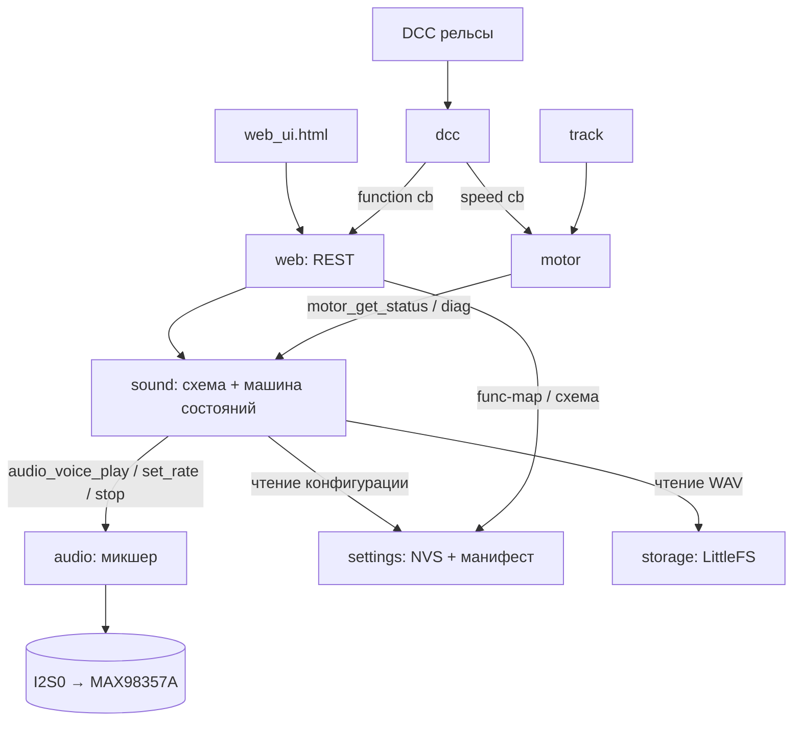

# Документ внедрения: звуковой движок (Sound Scheme Engine)

> Примечание: документ исторический. Сборка переведена на ESP-IDF 6.0
> (`firmware\idf_build.ps1`); упоминания `pio run`/PlatformIO относятся к
> ранним версиям.

Статус: **черновик/предложение**, версия 1, дата 2026-09-28.
Область: прошивка `firmware/` (ADDITIPUS AURA-X / Soft_Decoder_V3, v0.8).
Связанные документы: `ARCHITECTURE.md`.

Документ объединяет результаты исследования звуковых схем промышленных DCC-декодеров
(SoundTraxx Tsunami2, ESU LokSound 5, ZIMO MS/MX, ModeLLdepO SoundGT, стандарты NMRA
S-9.2.1/S-9.2.1.1/S-9.2.2), структурирует целевой функционал, сравнивает варианты
реализации, описывает модель данных, интеграцию в текущий код, план этапов и дизайн
веб-интерфейса.

---

## 1. Выжимка исследования (что делают именитые декодеры)

| Аспект | SoundTraxx Tsunami2 | ESU LokSound 5 | ZIMO MS/MX | ModeLLdepO SoundGT | **Сейчас у нас** |
|---|---|---|---|---|---|
| Модель схемы | Выбираемые CV-звуки + микшеры; поведение «зашито» | 32 sound slot + sound schedule (state machine, LokProgrammer) | Сэмплы + schedules (speed/accel/load) + CV | Звуковые таблицы (Init/Loop/End) + граф переходов | 20 слотов, F1..F20 → голоса; loop = удержание F |
| Роль трека | нет явной | slot | sample | **Init / Loop / End**, до 4 групп | нет |
| Двигатель ↔ скорость | notch, `CV114` speed-steps/notch + DDE по нагрузке | transition table проекта | sound steps, `CV#387/388/389` | таблицы D/A/CX, переходы по max/min speed и accel/decel | нет |
| Масштаб частоты сэмпла | нет (играется как есть) | проект | нет | **«Ускорение звука» 0..127** | нет |
| Запуск/останов двигателя | F5/F6 RPM±, interlock `CV114` | CV124 startup delay | coasting key `CV#374/375`, auto-coast `CV#398` | 1 F-клавиша запускает двигатель (обычно F1), схема M→S / S→M | F1 loop slot 1 |
| Пар | chuff computed/датчик | `CV57/58`, sensor | `CV#267/354`, cam `CV#268` | до 4 Init-трека (цилиндры), Loop-пауза от скорости | нет |
| Тормозной скрип | `CV196` (темп сброса тяги) | `CV64` порог | `CV#287` | пороги скорости + «переход на End заранее» | нет |
| F-маппинг | CV33..46 + Flex-Map 1.257..1.384 | 72 строки, 10 входов/условий A–J → 10 выходов K–T | CV33..46, Swiss Mapping, `CV#300` | F-клавиша, направление, состояние | `slot_a/slot_b/aux/dir/speed` |
| Типы эффекта | NMRA latching/momentary/trigger | play-mode слота (loop/one-shot/held) | loop-флаг per-sound | конечная/бесконечная таблица, случайные, по состоянию | всегда loop, пока F |
| Смешивание/приоритет | primary/alternate/reverb, клиппинг | до 10 каналов | несколько каналов | **4 канала**, 1 таблица = 1 канал | 20 голосов, суммирование с клиппингом |
| Случайные звуки | Fireman Ed | до 8 random-функций | Z1..Z8 | список «случайных включений» + интервалы | нет |
| Теория синхронизации | момент движения под звук | «sync with sound» | — | **CV30 «синхронизировать движение со звуком»** | нет |

### 1.1. Ключевые выводы (что определяет «звуковую схему»)
1. **Схема = банк сэмплов + маршрутизация/микширование + машина состояний.** Не список звуков.
2. **Двигатель нельзя привязывать только к «скорости».** Нужны минимум: скорость,
   ускорение/замедление (знак), состояние (стоянка/движение), направление, и — в идеале —
   **нагрузка** (BEMF/ток/рассогласование PID).
3. **Память ограничена, поэтому звук «ускоряют»:** записывают 1..N опорных сэмплов, а
   частоту воспроизведения масштабируют от скорости (SoundGT «Ускорение звука»). У нас
   уже есть ресемплинг — остаётся сделать его управляемым на лету.
4. **Init/Loop/End + переходы** — простая и достаточная модель для реализма
   (трогание, установившийся режим, выбег), дешевле чем полноценный schedule.
5. **F-кнопка активирует «эффект», а не обязательно мгновенный звук** (может зависеть
   от направления, скорости, состояния; может быть one-shot/loop/held).
6. **Арбитраж и приоритеты:** несколько звуков звучат одновременно; гудок при желании
   приглушает двигатель (ducking) — это логика проекта, не стандарт.
7. **NMRA даёт транспорт функций**, а не звук: групповые пакеты F0–F4/F5–F12/F13–F20/
   F21–F28, FL(f)/FL(r) через CV29 бит1 и CV33/34, типы latching/momentary/trigger.

---

## 2. Целевой функционал (структурирование)

Приоритеты: **P0** — основа, без неё смысла нет; **P1** — реализм; **P2** — полировка.

### 2.1. Функции звуковой схемы
| # | Функция | Приоритет | Источник идеи |
|---|---|---|---|
| F-01 | Роли треков Init / Loop / End на каждый звук | P0 | SoundGT |
| F-02 | Звуковая таблица: группа треков + параметры + условие перехода | P0 | SoundGT |
| F-03 | Схема двигателя как граф состояний (Stop, D-шаги, A, CX, переходные) | P0 | SoundGT |
| F-04 | Масштаб частоты воспроизведения loop-трека от скорости | P0 | SoundGT «Ускорение звука» |
| F-05 | Запуск/останов двигателя по выделенной F-клавише | P0 | SoundGT/ESU |
| F-06 | Переходы по знаковым ускорению/замедлению | P1 | SoundGT, ZIMO |
| F-07 | Влияние нагрузки (BEMF/PID-рассогласование) на «тон»/громкость двигателя | P1 | SoundTraxx DDE, ZIMO |
| F-08 | Несколько скоростных шагов (2..5) с переходными таблицами | P1 | SoundGT, notch |
| F-09 | Многоцилиндровый пар (4 Init-группы, пауза от скорости) | P1 | SoundGT, ESU/ZIMO |
| F-10 | Тормозной скрип с порогами и синхронизацией по CV3/CV4 | P1 | SoundGT |
| F-11 | Random/авто-звуки по состоянию (стоянка/движение/свет), с интервалами | P1 | все |
| F-12 | Режимы F: one-shot / loop-пока-нажата / latched / trigger | P1 | NMRA/ESU |
| F-13 | Приглушение двигателя под гудок (ducking, опционально) | P2 | ESU Soundfader |
| F-14 | «Синхронизировать движение со звуком» (модель чуть «думает» перед стартом) | P2 | SoundGT CV30 |
| F-15 | Раздельные таблицы по состоянию/направлению (`Стоим/Едем/Свет` × В/Н) | P1 | SoundGT/MD Prog |
| F-16 | Отдельный «короткий» вариант звука (`whistle short`) | P1 | SoundGT/MD Prog |
| F-17 | Фазировка chuff: «сдвиг цилиндров» min/max/inc | P1 | MD Prog |

### 2.2. Функции интерфейса (вход)
| # | Функция | Источник |
|---|---|---|
| I-01 | F0..F28 (расширить текущий UI с F0..F10) | NMRA |
| I-02 | Направление F: любое / вперёд / назад | уже есть `dir` |
| I-03 | Состояние F: любое / движется / стоит | уже есть `speed` |
| I-04 | Звук F: привязка к 1..2 слотам | уже есть `slot_a/slot_b` |
| I-05 | AUX-выходы F | уже есть `aux_mask` |
| I-06 | Режим воспроизведения F | новый |
| I-07 | Стартовая F-клавиша двигателя | новый |
| I-08 | Тип схемы (паровоз/дизель/электровоз), фиксируется при создании проекта | SoundGT |
| I-09 | Карта выходов: матрица `выход × (клавиша × направление)`, как в SoundGT | SoundGT, NMRA CV33..46 |
| I-10 | Карта звуков: `F × направление → таблица`, как в SoundGT | SoundGT |
| I-11 | Переработка текущего «строка на функцию» в карту many-to-many | NMRA/ESU/SoundTraxx |
| I-12 | Кнопки отмены звука по состояниям (mute Stop/Move/Light) | SoundGT/MD Prog |
| I-13 | Отдельные поля для таблиц по состоянию и «короткого» варианта | SoundGT/MD Prog |

### 2.3. Явно **не** делаем (для контроля объёма)
- Полноценный визуальный редактор schedule уровня LokProgrammer (дорого).
- Обратное воспроизведение сэмплов (нет в железе/коде).
- 64 состояния/неограниченный граф: фиксированный шаблон D/A/CX до 5 шагов + доп. звуки.
- Синтез/изменение тембра (только rate-scaling и громкость).

---

## 3. Варианты реализации и выбор

### Вариант A — «нарастить web.c/app_main» (не рекомендуется)
Добавить логику схемы прямо в `web_apply_function()` и колбэки.
- Плюсы: быстро, нет новых компонентов.
- Минусы: `web.c` уже большой; тайминг переходов и масштаб частоты — это **реальное
  время**, не HTTP-логика; тестируемость падает; появятся циклические зависимости
  `web ↔ audio/motor`. **Отклонён.**

### Вариант B — новый компонент `sound` + расширение `audio` (рекомендуется)
- Новый компонент `components/sound/`: владеет схемой, состоянием, тиком (20–50 мс).
- `audio` получает управление частотой воспроизведения и пул голосов.
- `settings` — новый NVS-blob + расширение манифеста.
- `web` — REST/UI, вызывает `sound_*`.
- `main` — инициализация и запуск задачи, `web_motion_changed` → `sound_set_speed`.
- Плюсы: изоляция, тестируемость (нативные тесты), нет циклов, честный реальный
  тайминг. **Принят.**

### Вариант C — офлайн-компилятор проекта (как LokProgrammer)
- Плюсы: гибко и быстро на устройстве.
- Минусы: огромный объём (ПК-приложение + формат), не решает текущую задачу. **Отложен.**

### 3.1. Под-решения
| Вопрос | Вариант 1 | Вариант 2 | Выбор |
|---|---|---|---|
| Хранение схемы | CV-пространство | **NVS blob + манифест** | NVS blob: CV (512 Б) не резиновые, схема — метаданные, а не CV |
| Граф двигателя | произвольный | **фиксированный шаблон** (Stop/D1..D5/A/CX/M→S/S→M) | фиксированный: проще UI, достаточно для реализма |
| Rate-scaling | в `web` | **в `audio`** | в audio: это часть микшера |
| Привязка звука | на слот | **таблица→треки** | таблицы, как в SoundGT |
| Голоса | 1 голос = 1 F | **пул + выделенные** | пул: функций больше, чем голосов |
| Триггер F | в `web.c` | **в `sound`** | в sound, `web.c` только вызывает API |
| Совместимость | заменить | **режимы: legacy / scheme** | режим, чтобы не сломать существующие проекты |

---

## 4. Целевая архитектура



Точки:
- **Единственный вход движения** для звука — `sound_set_speed(speed, forward)`, вызывается
  из `web_motion_changed()` (туда уже сходятся DCC и веб). Работает в обоих источниках.
- **Единственный вход функций** — `sound_function(fn, state)` (для звуковой части) рядом
  с существующим `web_apply_function()` (AUX/legacy).
- **Задача `sound`** (prio 6, период 20 мс) тикает машину состояний, считает ускорение,
  нагрузку, запускает/переключает таблицы, обновляет rate двигателя, обслуживает random и
  тормозной скрип.

---

## 5. Модель данных

Новый компонент `sound` (или новый раздел `settings`) хранит:

```c
#define SOUND_MAX_TABLES            32   /* двигатель + доп. звуки          */
#define SOUND_MAX_TRACKS_PER_TABLE  12
#define SOUND_ENGINE_STEPS           5   /* количество скоростных шагов     */
#define SOUND_MAX_EXTRAS            24
#define SOUND_FILE_MAX             128
#define SOUND_NAME_MAX              24

typedef enum { SOUND_ROLE_INIT = 0, SOUND_ROLE_LOOP = 1, SOUND_ROLE_END = 2 } sound_role_t;

typedef enum {
    SOUND_SCHEME_NONE = 0,   /* звук выключен                              */
    SOUND_SCHEME_LEGACY,     /* текущее поведение: F1..F20 = слоты (совместимость) */
    SOUND_SCHEME_DIESEL,
    SOUND_SCHEME_STEAM,
    SOUND_SCHEME_ELECTRIC
} sound_scheme_type_t;

typedef struct {                 /* одна ячейка таблицы                     */
    uint8_t slot;                /* 0 = пусто, иначе слот файла 1..20       */
    uint8_t role;                /* SOUND_ROLE_*                            */
    uint8_t group;               /* 0..3: цилиндры/подгруппы (пар)          */
} sound_track_ref_t;

typedef struct {                 /* звуковая таблица                        */
    bool     used;
    char     name[SOUND_NAME_MAX];
    uint8_t  track_count;
    sound_track_ref_t tracks[SOUND_MAX_TRACKS_PER_TABLE];

    /* условия «прервать Loop и перейти дальше» */
    uint8_t  max_speed;          /* 0 = не задано; иначе прерывание выше    */
    uint8_t  min_speed;          /* 0 = не задано; иначе прерывание ниже    */
    int8_t   max_accel;          /* знаковое; + разгон, − замедление        */
    int8_t   max_decel;

    /* поведение воспроизведения */
    uint8_t  rate_scale;         /* 0..127: «ускорение звука» (SoundGT)     */
    uint8_t  min_plays;          /* 0..15: минимум повторов Loop            */
    uint8_t  max_plays;          /* 0..15: максимум повторов Loop           */
    bool     engine_only;        /* «не включать без двигателя»             */

    /* граф (только таблицы схемы двигателя) */
    uint8_t  end_table;          /* «окончание» (для конечных) или NONE     */
    uint8_t  next_accel;         /* переход по max_accel                    */
    uint8_t  next_decel;         /* переход по max_decel                    */
} sound_table_t;

typedef struct {                 /* схема двигателя                          */
    uint8_t  start_table;        /* M→S: запуск двигателя                    */
    uint8_t  stop_table;         /* Stop: ХХ (бесконечная)                   */
    uint8_t  shutdown_table;     /* S→M: глушение                            */
    uint8_t  drive[SOUND_ENGINE_STEPS];   /* D1..D5                          */
    uint8_t  accel[SOUND_ENGINE_STEPS];   /* A1..A5                          */
    uint8_t  coast[SOUND_ENGINE_STEPS];   /* CX1..CX5                        */
    uint8_t  engine_start_fn;    /* F-клавиша запуска (обычно 1)            */
    /* MD Prog: «сдвиг цилиндров» — фазировка chuff от скорости (пар) */
    uint8_t  cyl_shift_min;
    uint8_t  cyl_shift_max;
    uint8_t  cyl_shift_inc;      /* «увеличение сдвига цилиндров»           */
    uint8_t  flags;              /* SOUND_ENG_SKIP_STOD1 / SOUND_ENG_SKIP_D1TOS */
    bool     sync_motion;        /* «синхронизировать движение со звуком»   */
} sound_engine_t;

/* Опции схемы (в MD Prog/SoundGT — биты CV30). */
#define SOUND_ENG_SKIP_STOD1  (1u << 0)  /* «Skip StoD1»                 */
#define SOUND_ENG_SKIP_D1TOS  (1u << 1)  /* «Skip D1toS»                 */

typedef enum {
    SOUND_MODE_ONE_SHOT = 0,     /* одиночный по фронту                      */
    SOUND_MODE_LOOP_HELD,        /* loop, пока нажата                        */
    SOUND_MODE_SHORT_LONG,       /* короткое/длинное нажатие (гудок)         */
    SOUND_MODE_LATCHED,          /* loop по состоянию (вкл/выкл)             */
    SOUND_MODE_TRIGGER,          /* one-shot с запретом повтора N мс         */
    SOUND_MODE_RANDOM,           /* случайно                                 */
    SOUND_MODE_STATE             /* по состоянию (стоит/едет/свет)           */
} sound_mode_t;

typedef struct {                 /* дополнительный звук                      */
    uint8_t  table;              /* индекс таблицы                           */
    uint8_t  fn;                 /* F0..F28 или 0xFF = без клавиши           */
    uint8_t  dir;                /* 0 любое / 1 вперёд / 2 назад             */
    uint8_t  state;              /* 0 любое / 1 едет / 2 стоит               */
    uint8_t  mode;               /* SOUND_MODE_*                             */
    uint16_t random_min_ms;      /* для RANDOM                               */
    uint16_t random_max_ms;
    uint8_t  volume;             /* 0..100 поверх общей                      */
} sound_extra_t;

typedef struct {                 /* тормозной скрип                          */
    uint8_t  max_on_speed;       /* выше этой скорости скрипа нет            */
    uint8_t  min_brake_speed;    /* порог начала торможения                  */
    int8_t   stop_margin;        /* «разница скоростей для выключения»       */
    uint8_t  end_speed;          /* «порог перехода на End-трек»             */
} sound_brake_t;

typedef struct {                 /* весь проект схемы                        */
    uint8_t  type;               /* sound_scheme_type_t                      */
    uint8_t  table_count;
    sound_table_t tables[SOUND_MAX_TABLES];
    sound_engine_t engine;
    uint8_t  extra_count;
    sound_extra_t extras[SOUND_MAX_EXTRAS];
    sound_brake_t brake;
} sound_scheme_t;
```

**Подтверждено MD Prog (§22):** у каждого звука — роли Init/Loop/End
(в проекте `begin/loop/end`); допустимы одиночные треки (`coupler`, `valve`,
`break release`) и отдельный **короткий** вариант (`whistle short`), который в модели
задаётся как `short_table` привязки (§8.4/§20.9).

Оценка размера: `sound_table_t` ≈ 12*3 + ~30 ≈ 70 Б; 32 таблицы ≈ 2.3 КБ;
extras ≈ 24*12 ≈ 300 Б; итого схема ≈ **3 КБ**.

> **Решение о хранении (уточнено по ТЗ, §17 T-02):** схема хранится **файлами
> `/projects/*.mds` на внешней NOR** (LittleFS), а в NVS лежит только указатель
> `active_scheme`. Это снимает лимит NVS и позволяет возить схемы в OTA-контейнере.
> Вариант «NVS blob `sound_sch`» ниже оставлен как альтернатива для встраиваемых дефолтов.

### 5.1. Манифест (переживает полный erase NVS)
Расширить `/userdata/audio/tracks.txt` (версия 2, обратно совместимый парсер):
```
AURA-TRACKS 2
T;<slot>;<cat>;<enabled>;<file>;<label>
F;<idx>;<slot_a>;<slot_b>;<aux_mask>;<dir>;<speed>;<mode>     ; mode добавлен
S;<type>;<engine_start_fn>;<start>;<stop>;<shutdown>;<drive0..4>;<accel0..4>;<coast0..4>
ET;<idx>;<used>;<role>;<group>;<max_sp>;<min_sp>;<accel>;<decel>;<rate>;<minp>;<maxp>;<engonly>;<end>;<n_accel>;<n_decel>;<name>
EX;<idx>;<table>;<fn>;<dir>;<state>;<mode>;<rmin>;<rmax>;<vol>
BR;<max_on>;<min_brake>;<margin>;<end>
```

---

## 6. Звуковой движок: состояния, переходы, алгоритмы

### 6.1. Шаблон графа двигателя (как SoundGT)
```
        ┌─────────┐  скорость>0   ┌──────────────┐  окончание  ┌──────────┐
        │ M to S  │──────────────▶│ Stop to D1   │────────────▶│   D1     │
        │ (пуск)  │               │ (трогание)   │             │ (ход 1)  │◀┐
        └─────────┘               └──────────────┘             └────┬─────┘ │
                                                          accel │   │ decel
                                                      ┌─────────▼┐  ▼       │
                                                      │   A1    │  ┌──────┐ │
                                                      │ (разгон)│  │ CX1  │─┘
                                                      └─────────┘  └──────┘
                              D1 ⇄ D2 (переходы ступеней, до D5)
        останов двигателя:  D* / CX* ──▶ S to M (глушение) ──▶ Stop
```
Состояния (имена подтверждены таблицами MD Prog, §22.1): `M to S`, `S to M`, `Stop`,
`Stop to D1`, `D1 to Stop`, `D1 to A1`, `A1 to D1`, `D1 to CX1`, `CX1 to D1`,
`CX1 to Stop`, `D1 to D2`, `D2 to D1`, `D2 to A2`, `A2 to D2`, `A1 to A2`,
`D2 to CX2`, `CX2 to D2`, `D2 to D3` … до `D5/A5/CX5`.
Переходы задаются таблицами (`end_table`, `next_accel`, `next_decel`) и условиями
(`max/min_speed`, `max_accel/decel`). Любую таблицу, кроме стартовой, можно пропустить,
если граф неразрывен (проверка при сохранении). Опции пропуска `Stop→D1` / `D1→Stop`
(в SoundGT — биты CV30 `Skip StoD1` / `Skip D1toS`) хранятся в `sound_engine_t.flags` (§5).

### 6.2. Тик машины состояний (20 мс)
```
каждый тик:
  motor_get_applied_speed(&speed, &fwd)             // ФАКТИЧЕСКАЯ (ramped), не target!
  d_speed = speed - prev_speed
  accel_raw = d_speed / dt                          // знаковая величина
  accel = accel + 0.3*(accel_raw - accel)           // EMA α≈0.3 (см. §17 T-05)
  load  = f(duty, bemf_error)                       // из motor diagnostics
  если engine_on:
      таблица = evaluate(current, speed, accel, load, end_of_loop)
      если таблица изменилась -> crossfade (см. 6.4)
  rate = rate_for(table, speed, load)               // см. 6.3
  sound_tick_random(); sound_tick_brake();
```

Пороги (`max/min_speed`, `max_accel/decel`) сравниваются **с гистерезисом** (≈±2 единицы),
чтобы на границе notch не было дребезга переходов (§17 T-05).

### 6.3. Масштаб частоты («ускорение звука»)
Аналог параметра SoundGT `0..127`. Принимаем формулу из ТЗ (§17, T-03): при нормализованной
скорости `v` (0..255) и параметре таблицы `sound_accel` (0..127):
```
rate = base × (1 + v/255 × sound_accel/64)          // клип 0.5×..3× от base
rate_permille = round(1000 × rate / base)           // 500..3000, base = опорный темп
```
Для пара Loop-трек проигрывается быстрее → чаще удары цилиндров («чем больше скорость,
тем меньше пауза»). Плавность: целевой rate сглаживается в микшере (см. §7.1), чтобы не
было «ступенек» на границах notch.

### 6.4. Переключение таблиц
- **Конечная таблица** (без Loop): играется целиком, затем `end_table` (или следующий
  шаг). Для перехода «на ходу» применяем **crossfade** 2 голосами: новый стартует с 0
  громкости, старый гасится за ~80–150 мс (если не нужен — стоп нового/старого).
- **Бесконечная таблица**: Loop крутится до условия; `min_plays`/`max_plays` считаются
  микшером/движком.

### 6.5. Влияние нагрузки (P1)
`motor_bemf_diag()` даёт `error` (рассогласование PID) и `duty`. Нормируем
`load = clamp(error / error_max, -1..1)`; используем для: (а) выбора более «тяжёлой»
таблицы на подъёме, (б) ±громкости и ±rate двигателя (аналог DDE/ZIMO CV#275..286).
Реализовать как множитель поверх громкости двигателя (без изменения шага скорости).

### 6.6. Тормозной скрип (P1, как SoundGT)
Параметры в `sound_brake_t`; на тике отслеживаем переход «ехали → тормозим»
(отрицательное ускорение/уменьшение speed) и скорость:
```
если speed падает и была >= min_brake_speed:
   пока speed > end_speed: loop скрипа активен (rate от скорости)
   когда speed <= end_speed: скрип стопается на stop_margin раньше полной остановки,
                             затем End-трек ровно к моменту 0
```
Параметры синхронизации зависят от CV3/CV4 — в UI предусмотреть кнопку
«откалибровать под текущие CV3/CV4»/подсказку.

### 6.7. Random/авто-звуки (P1)
Отдельный список `extras` с `mode=RANDOM`/`STATE`: таймеры min/max, гейты по
состоянию/направлению/свету, обязательное `max_plays` (иначе звук зациклится навсегда —
это частая ошибка в SoundGT, документируем).

### 6.8. Приоритеты и ducking (P2)
- Несколько звуков суммируются; при перегрузке — клиппинг (уже есть).
- Ducking: пока активен «гудок» (F-эффект с флагом duck), громкость двигателя
  временно ×0.4; восстановление с задержкой ~300 мс. Настраиваемо per-extra.

---

## 7. Изменения по компонентам

### 7.1. `components/audio` (P0)
- В `voice_state_t`/`voice_t` добавить `uint16_t rate_permille` (запрос) и
  `double rate_cur` (сглаженный).
- В `voice_fill()`: `step = sample_rate / MIX_RATE * (rate_cur / 1000.0)`;
  `rate_cur` подтягивать к `rate_permille/1000` по блокам (простой lerp).
- Новый API:
  ```c
  esp_err_t audio_voice_set_rate(uint8_t voice, uint16_t permille); /* 500..2000 */
  ```
- (опц. P1) Пул: `int8_t audio_voice_alloc(void); void audio_voice_release(uint8_t v);`
  — для динамического распределения голосов под extras/random; сейчас жёсткая привязка
  `voice = fn-1` (F1..F10 занимают ещё и 10..19) мешает.
- Тесты: скорость ресемплинга при разных rate, отсутствие щелчков (по амплитуде).

### 7.2. `components/settings` (P0)
- Добавить `sound_store_load/save` (`.mds` в компоненте `sound`); указатель `active_scheme` — в NVS.
- Расширить `track_manifest.c`: версия 2, новые записи `S;/ET;/EX;/BR;`, обратная
  совместимость (старый `F;` без `mode` читается как `mode=LATCHED`).
- Дефолты: `type=NONE` (не ломаем текущих пользователей), `engine_start_fn=1`.

### 7.3. `components/sound` (новый, P0)
- Файлы: `src/sound.c`, `include/sound.h`, возможно `src/sound_scheme.c`.
- Зависимости CMake: `audio motor settings storage esp_timer` — **без `web`**.
- Задача `sound` (стек 4096, prio 6, период 20 мс).
- API (черновик):
  ```c
  esp_err_t sound_init(void);            /* загрузка схемы, старт задачи       */
  void sound_set_speed(uint8_t speed, bool forward);
  void sound_function(uint8_t fn, bool state);
  void sound_stop_all(void);             /* reset / emergency                  */
  bool sound_engine_is_on(void);
  void sound_set_scheme_type(uint8_t type);
  /* редактор (из web) */
  esp_err_t sound_scheme_get(sound_scheme_t *out);
  esp_err_t sound_scheme_set(const sound_scheme_t *in);
  esp_err_t sound_table_set(uint8_t idx, const sound_table_t *t);
  esp_err_t sound_extra_set(uint8_t idx, const sound_extra_t *e);
  void sound_status_json(char *buf, size_t n); /* для /api/sound/status */
  ```
- Внутреннее: таблица состояний, `prev_speed`, таймеры random/brake, crossfade.

### 7.4. `components/web` (P0/P1)
- `web_apply_function()`: для F-клавиш, привязанных к звуковой схеме, вызывать
  `sound_function(fn,state)` (AUX-часть оставить как есть). При `type=NONE` — прежнее
  поведение (слоты/legacy).
- Новые маршруты (см. §9), UI (см. §10).
- Убрать жёсткие `fn<=20`/`voice=fn-1`, если включается пул голосов (P1).

### 7.5. `main/app_main.c` (P0)
- Порядок: `... audio_init → sound_init → dcc_init → web_init ...`
  (sound зависит от audio/settings/motor).
- `web_motion_changed()` (или колбэк DCC) → `sound_set_speed()`.
- Reset/estop → `sound_stop_all()`.
- `settings_manifest_sync()` уже вызывается из settings-save — новые записи попадут
  автоматически.

### 7.6. `components/selftest` / `provision` (P1)
- `HIL-SOUND-SCHEME <state>`/`HIL-SCHEME-SPEED <n>` для проверки переходов по UART.

---

## 8. Карта выходов/функций (function mapping)

### 8.1. Как это сделано в SoundGT (по скриншотам MD Prog)
В программе ModeLLdepO это **две дополняющие друг друга матрицы**, а не список «функция → слот».

**(a) «Карта выходов»** (`data/50/img/image018.gif`) — матрица
`выход × (кнопка × направление)`:

```
Карта выходов
              Свет(F0)   F1        F2        F3   ...   F12
               В  Н     В  Н      В  Н      В  Н       В  Н
Свет вперёд   [x] □     □  □      □  □      □  □       □  □
Свет назад    □  [x]    □  □      □  □      □  □       □  □
Выход FL1     □  □     [x] [x]   [x] [x]   □  □       □  □
Выход FL2     □  □     □  □      □  □      [x] [x]    □  □
   В — направление движения вперёд, Н — назад
```

- Строки — **выходы** (свет вперёд, свет назад, FL1, FL2), столбцы — **клавиши**
  (`Свет`=F0, F1..F12), под каждой клавишей два подстолбца **В/Н** (направление).
- Галка на пересечении = «этот выход активируется этой клавишей при этом направлении».
- Правило направления: если галка стоит только в одном подстолбце (только В или только Н),
  выход активен лишь при совпадающем направлении и гаснет при его смене.
- Подпись в документе: «*включение кнопки активирует эффект на этом выходе*», а не
  мгновенное напряжение. Речь именно об активации эффекта, а не о прямом уровне.

**(b) «Включение звуков»** (`data/50/img/image032.gif`) — таблица
`F-клавиша × направление → звуковая таблица`:

```
Включение звуков        Вперёд            Назад
F1                      M to S            M to S
F2                      Glocke            Glocke
F3                      Pfiff             —
F8                      Pfiff_1           Pfiff_1
F9                      Brenner           Brenner
```

- Строки — клавиши F1..F12, столбцы — **Вперёд/Назад**, в ячейке — имя звуковой таблицы.
- Один и тот же F может звучать по-разному (или молчать) в каждом направлении.

Дополнительно (отдельные списки, не матрица):
- **«Звуки по состоянию»** (`image033.gif`): стоит / едет / включён свет; конечная
  таблица играется один раз по наступлению состояния (напр. короткий гудок при трогании).
- **«Случайные звуки»** (`image034.gif`) + интервал включения.
- **«Тормозные колодки»** (`image035.gif`) с порогами скорости.

Итого в SoundGT: **карта выходов** (CV33..46-подобная) + **карта звуков** (по F и
направлению) + **списки состояний/случайные**.

### 8.2. Как у больших брендов (почему «карта», а не «строка»)
- **NMRA**: CV33=FL(f), CV34=FL(r), CV35..46=F1..F12, каждый бит — выход; направление —
  отдельные FL(f)/FL(r) и CV14/22. Это и есть битовая матрица `выход × функция`.
- **SoundTraxx**: legacy CV33..46 + **Flex-Map** CV1.257..1.384 (эффект → клавиша F0..F28) и
  CV1.385..1.512 (доп. условия: направление/движение).
- **ESU**: строки маппинга со входами-условиями (движение, направление, F on/off, датчик)
  → выходы (физические, логические, слоты). До 10 звуков одновременно.
- **ZIMO**: CV33..46 + Swiss Mapping (`CV430..507`, 10+ групп) — тоже матрица с логикой.

Вывод: маппинг — это **набор правил many-to-many «условие → цель»**, а не
«одна функция = один слот». Наша текущая модель — вырожденный случай.

### 8.3. Наши ограничения сегодня
`settings_func_map_t[F0..F28]` = «строка на функцию»: `slot_a`, `slot_b`, `aux_mask`,
`dir`, `speed`. Проблемы:
- жёсткие завязки `F1→слот1`, `voice=fn-1`, F1..F10 занимают ещё и голоса 10..19;
- максимум 2 слота на функцию;
- направление/скорость заданы на **функцию**, а не на отдельную цель;
- один выход нельзя завести на несколько клавиш с разными условиями;
- UI показывает только **F0..F10** (`for(var f=0;f<=10;f++)`) при 29 допустимых.

### 8.4. Целевая модель: список привязок + матричный UI
Канонические данные — **список привязок** (`func_binding_t`), а матрица — его проекция.
Список естественно описывает many-to-many, легко строится в обе матрицы и допускает
доп. условия (направление, состояние, ducking) без раздувания строк.

```c
#define FUNC_TARGET_NONE    0
#define FUNC_TARGET_OUTPUT  1   /* target_id = индекс выхода 0..8 (F0F,F0R,AUX1..7) */
#define FUNC_TARGET_SOUND   2   /* target_id = индекс звуковой таблицы               */
#define FUNC_TARGET_SLOT    3   /* target_id = слот 1..20 (совместимость)            */
#define FUNC_TARGET_LOGIC   4   /* target_id = логическая функция (mute, drive hold) */

#define FUNC_DIR_ANY    0
#define FUNC_DIR_FWD    1
#define FUNC_DIR_REV    2
#define FUNC_STATE_ANY     0
#define FUNC_STATE_MOVING  1
#define FUNC_STATE_STOPPED 2

#define FUNC_FLAG_DUCK   (1u << 0)   /* приглушить двигатель, пока активен */
#define FUNC_FLAG_INVERT (1u << 1)

#define FUNC_BIND_MAX 64
typedef struct {
    uint8_t used;         /* 0 = пустая запись                                 */
    uint8_t fn;           /* F0..F28                                          */
    uint8_t target_type;  /* FUNC_TARGET_*                                    */
    uint8_t target_id;    /* выход / таблица / слот / логика                  */
    uint8_t dir;          /* FUNC_DIR_*                                       */
    uint8_t state;        /* FUNC_STATE_*                                     */
    uint8_t mode;         /* SOUND_MODE_* (для SOUND/SLOT) */
    uint8_t flags;        /* FUNC_FLAG_*                                      */
    uint8_t short_table;  /* «короткий» звук при быстром нажатии (0 = нет)    */
    uint8_t reserved;
    uint16_t short_ms;    /* порог короткого нажатия, напр. 400 мс            */
    uint16_t min_ms;      /* минимальная длительность звучания, напр. 150 мс  */
    uint16_t fade_ms;     /* затухание при отпускании, напр. 80 мс            */
} func_binding_t;
```

Почему список, а не матрица в NVS: many-to-many, покрывает обе матрицы SoundGT,
поддерживает состояние/duck, не привязан к 29 фиксированным строкам и даёт чистую
миграцию из старого формата.

### 8.5. Алгоритм оценки привязок
```
func_eval(fn, state, dir) -> out_mask (+ запуск/стоп звуков)
  out_mask = 0
  для каждой привязки b:
     если !b.used или b.fn != fn:            continue
     если b.dir  != ANY и b.dir  != dir:     continue
     если b.state!= ANY и b.state!= state:   continue
     switch b.target_type:
       OUTPUT: out_mask |= (1u << b.target_id)
       SOUND:  sound_binding_apply(b.target_id, b.mode, active, b.flags)
       SLOT:   sound_slot_apply(b.target_id,  b.mode, active, b.flags)   /* legacy */
       LOGIC:  logic_apply(b.target_id, active)
  return out_mask
```
`active` = «клавиша нажата И условия совпали». Дельта-логика `s_func_last_mask[fn]`
(гашение снятых выходов) переиспользуется без изменений.

Поведение по `mode`:
- output: steady/эффект (уже в `aux_cfg`);
- sound/slot: `ONE_SHOT` (по фронту 0→1), `LOOP_HELD` (пока active), `SHORT_LONG`
  (короткое нажатие → `short_table`, иначе loop + fade; см. §20.9), `LATCHED`
  (по состоянию), `TRIGGER` (one-shot + cooldown), `RANDOM`/`STATE` — через extras.
- **Подтверждено MD Prog (§22.4):** есть ровно такие привязки — «Звуковая таблица для
  `Стоим/Едем/Свет` вперёд/назад» (это `SOUND`-привязки с `state`/`dir` и `fn=0xFF`),
  `F8..F12` вперёд/назад (F-привязки) и «Кнопка отмены звука для `Стоим/Едем/Свет`» — это
  mute-логика (`LOGIC`-привязки `MUTE_STOP/MOVE/LIGHT`).

### 8.6. Матричный UI (проекция списка)
**«Карта выходов»** — строки = 9 выходов, столбцы = `F0..F28 × В/Н`:

```
                    F0(Свет)   F1        F2        ...  F28
                     В  Н     В  Н      В  Н           В  Н
Свет вперёд         [x] □    □  □      □  □           □  □
Свет назад          □  □    □  □      □  □           □  □
AUX1                □  □    [x] [x]   □  □           □  □
...
```

**«Карта звуков»** — строки = таблицы/слоты, столбцы = `F × В/Н`, в ячейке имя таблицы:

```
            Вперёд        Назад
F1          M to S        M to S
F2          Glocke        Glocke
F3          Pfiff         —
```

- Условие «стоит/едет» и «режим» — вторичные селекторы строки/ячейки, чтобы матрица
  осталась компактной (переключаются в редакторе ячейки).
- Ширина 29×2 столбцов: горизонтальный скролл с «залипающими» заголовками строк;
  на мобильных — аккордеон по F-клавише (те же данные, представление строчками).
- Матрица — **двусторонняя проекция**: клик по пустой ячейке создаёт привязку, клик по
  галке удаляет; снятие одной галки не трогает остальные привязки той же цели.

### 8.7. Хранение и REST
- Канонические привязки: NVS blob `func_bind` (`func_binding_t[64]`), плюс записи `B;`
  в манифесте (версия 2). Старый ключ `func_map` читается один раз и конвертируется:
  `slot_a/slot_b → SOUND/SLOT`, `aux_mask → OUTPUT`, `dir`, `speed → state`.
- `settings_func_bind_load/save()`, `settings_func_bind_legacy_convert()`.
- REST (см. §9): `GET /api/func-map` отдаёт привязки; `GET /api/func-map?view=matrix`
  — обе матрицы для UI; `POST` принимает привязки (и, для совместимости, старый формат
  строк F, который конвертируется в привязки).

## 9. REST API (новые маршруты)

| Метод | URI | Назначение |
|---|---|---|
| GET | `/api/sound/status` | текущее состояние: тип, активная таблица, engine on, speed, rate, нагрузка |
| GET/POST | `/api/sound/scheme` | тип схемы, параметры двигателя, brake |
| GET/POST | `/api/sound/table?idx=N` | чтение/запись одной таблицы (треки/параметры/переходы) |
| GET/POST | `/api/sound/extra?idx=N` | чтение/запись одного доп. звука |
| POST | `/api/sound/preview?slot=N&loop=0/1` | прослушать WAV (уже есть `/api/audio/play`) |
| GET | `/api/sound/lint` | проверка неразрывности графа и пустых ссылок |
| POST | `/api/sound/reset` | сброс схемы в дефолт (не трогая файлы) |
| GET/POST | `/api/func-map` | + поле `mode` (расширение, обратно совместимо) |

Ошибки: `{"ok":false,"error":"..."}`; линт возвращает список проблем (нет стартовой
таблицы, битый `end_table`, `min_speed>max_speed`, пустая таблица в графе).

---

## 10. Интерфейс (web UI)

> Авторинг звуковой схемы — конструктор звуков `/sound-editor/blocks.html`
> (`docs/sound_blocks_editor.md`). Ниже — краткая версия.

Принципы: не перегружать главный экран; звуковая схема — **отдельная сворачиваемая
панель**; редактор с драг-н-дропом файлов из списка загрузки; живое прослушивание.

### 10.1. Главный экран
- **Новая панель «Звуковая схема»** (сворачиваемая, после «Загрузка звуков»):
  - переключатель типа проекта: `Выкл / Дизель / Паровоз / Электровоз` (смена типа —
    с подтверждением, т.к. перестраивает шаблон; в духе SoundGT «изменить потом нельзя»);
  - поле «Клавиша запуска двигателя» (по умолчанию F1);
  - чекбокс «Синхронизировать движение со звуком»;
  - **карта состояний** (мини-схема, как в SoundGT) кликабельная: клик по карточке
    открывает редактирование таблицы;
  - индикатор состояния в реальном времени: `активно: D2 · скорость 42 · rate 1120`.
- **Расширить панель «Настройка функции F»** до F0..F28 (сейчас F0..F10), добавить
  колонку «Режим» (one-shot / loop / latched / trigger).

### 10.2. Редактор таблицы (модальная форма)
```
┌ Sound table: D1 (дизель) ────────────────────────────┐
│ Имя: [D1            ]   [x] Не включать без двигателя │
│ Треки:                                                 │
│  Группа 1   Init [slot 3 ▾]  Loop [slot 4 ▾]  End [— ▾]│
│  Группа 2..4 (пар/цилиндры)                            │
│ Условия перехода:                                      │
│  Max скорость [ 40 ] → [D2 ▾]    Min скорость [ 0 ]    │
│  Max ускорение [ +12] → [A1 ▾]   Max замедление [ −8]  │
│ Ускорение звука [ 20 ]   Повторы min [0] max [0]       │
│ Окончание → [Stop to D1 ▾]                             │
│ [▶ Прослушать]  [Отмена]  [Сохранить]                  │
└────────────────────────────────────────────────────────┘
```

### 10.3. Панель «Доп. звуки»
Таблица extras: `Таблица | Клавиша | Напр. | Состояние | Режим | Интервал | Громк.`.
Строка «Тормозные колодки» с четырьмя порогами и подсказкой про CV3/CV4.

### 10.4. Поведение/UX
- Драг WAV из общего списка файлов в ячейку Init/Loop/End.
- Валидация на лету (подсветка битых ссылок, `api/sound/lint` при сохранении).
- Шаблоны: «Дизель 2 шага», «Паровоз 4 цилиндра», «Электровоз» — создают заготовку.
- Живое прослушивание таблицы без поездки: кнопка `▶` шлёт `/api/sound/preview`.
- Не ломать существующий UI: при `type=NONE` панель показывает «Схема выключена
  (используется режим слотов)».

---

## 11. Совместимость и миграция
- **По умолчанию `type=NONE`** → поведение ровно как сейчас (F1..F20 loop-слоты).
  Пользовательские проекты не ломаются.
- Манифест версии 2 читается старым парсером частично (он игнорирует незнакомые `S;`),
  а новый парсер понимает версию 1. Обратная совместимость в обе стороны.
- `settings_func_map_t`: добавить `mode` (новое поле в конце blob). Старые blob короче —
  читать с проверкой длины и подставлять `mode=LATCHED`.
- **Привязки (`func_bind`) и старый `func_map` сосуществуют:** при первом старте с пустым
  `func_bind` старый `func_map` конвертируется в привязки и сохраняется; старый ключ не
  удаляется (страховка отката). Пока `func_bind` пуст, всё работает как раньше.
- **Матричный UI обратно совместим:** `POST /api/func-map` в старом формате строк F
  принимается и конвертируется в привязки, поэтому старая страница/скрипты не ломаются.
- Аудио: сигнатуры `audio_voice_play` не меняются; rate — новый вызов, по умолчанию 1000.

---

## 12. Детальный план по шагам

> Приоритетная (оптимизированная) версия порядка работ — **§21**. Этот раздел остаётся
> пошаговой детализацией «что/где/как», но выбор вариантов и объём — по §21.

Формат шага: **что / где / как / проверка**. Шаги идут в порядке зависимостей;
каждый завершается сборкой и тестами, «Definition of Done» — в конце раздела.

### Этап 0. Аудио: управляемая частота и пул голосов (P0)

**0.1. Поля частоты в структурах голоса.**
Файлы: `components/audio/src/audio.c`. В `voice_state_t` добавить `uint16_t rate_permille`
(целевая, 1000 = номинал) и `double rate_cur` (сглаженная); в `voice_t` — `uint16_t req_rate`.
Проверка: компиляция, поведение при `rate=1000` не меняется.

**0.2. Учесть rate в микшере.**
В `voice_start()` инициализировать `rate_cur=rate_permille/1000.0`. В `voice_fill()` заменить
`double step = sample_rate / MIX_RATE;` на
`step = (sample_rate / MIX_RATE) * st->rate_cur;`.
Проверка: `test_audio` — при `rate=2000` число прочитанных сэмплов за блок удваивается.

**0.3. Сглаживание частоты (анти-щелчок).**
В начале каждого блока: `rate_cur += (target - rate_cur) * 0.25;` (или шаг не более 2 %
за блок ≈ 11.6 мс). Проверка: без разрывов амплитуды при ступенчатом изменении.

**0.4. API установки частоты.**
Добавить `esp_err_t audio_voice_set_rate(uint8_t voice, uint16_t permille);` (клип
500..2000), запись через `s_req_mutex` в `req_rate`, применение в `mixer_task`.
Заголовок: `components/audio/include/audio.h`. Проверка: `test_audio` через injection.

**0.5. Пул голосов.**
Добавить `int8_t audio_voice_alloc(uint8_t owner_tag); void audio_voice_release(uint8_t v);`
и таблицу владельцев. Сейчас жёстко `voice=fn-1` (F1..F10 ещё и 10..19) — пул нужен для
двигателя/эффектов/random. Проверка: выдача/освобождение, отсутствие утечек.

**0.6. Проверки занятости/остановки.**
`audio_voice_stop` при освобождении пула; функция `audio_voice_is_active(v)`.
Проверка: `test_audio`.

**0.7. Заглушки и тесты.**
`test_libs/teststubs` — rate/alloc; `test_audio.c` — новые кейсы. Проверка: `run_tests.ps1`.

### Этап 1. Хранение и модель данных (P0)

**1.1. Общие типы схемы.**
Новый заголовок `components/settings/include/sound_types.h` (без зависимостей): `sound_scheme_t`,
`sound_table_t`, `sound_track_ref_t`, `sound_engine_t`, `sound_extra_t`, `sound_brake_t`,
`sound_mode_t`, `func_binding_t` (из §5 и §8.4). Подключают `settings`, `sound`, `web`.
Проверка: компиляция обоих компонентов.

**1.2. Файловое хранение схемы `.mds`.**
Компонент `sound`: `sound_store_load/save(sound_scheme_t*)`, формат
`[magic "MDS1"][ver][size][crc32][struct]` (см. §20.6); каталог
`storage_get_root()/projects`. Указатель `active_scheme` — в NVS (`settings`).
`settings` не трогаем (там только NVS). Проверка: `test_sound`
(запись/чтение, битый файл → дефолт).

**1.3. Дефолты.**
`type=SOUND_SCHEME_NONE`, `engine_start_fn=1`, пустая схема. Проверка: при отсутствии
ключа устройство работает как сейчас.

**1.4. Манифест v2 — писатель.**
`track_manifest.c`: `MANIFEST_VERSION 2`; добавить записи `S;`, `ET;`, `EX;`, `BR;`, `B;`
(формат в §5.1/§8.7). Вызывается из `sound_store_save` / `settings_func_bind_save`.
Проверка: `test_track_manifest` — round-trip.

**1.5. Манифест v2 — парсер + совместимость v1.**
Читать v1 (без `mode`/`S;`/`B;`) и v2; неизвестные строки игнорировать. Проверка:
`test_track_manifest` (v1-файл → корректное состояние).

**1.6. Привязки функций + миграция.**
`settings_func_bind_load/save` (ключ `func_bind`); `settings_func_bind_legacy_convert()`
преобразует старый `func_map` в привязки (один раз, при пустом `func_bind`). Проверка:
`test_settings` — конверсия `slot_a/slot_b/aux/dir/speed`.

**1.7. Обновить тест-скрипты.**
`test/run_tests.ps1`, `test/coverage.ps1`: `$inc`/`$suites` при необходимости.
Проверка: `run_tests.ps1`, `coverage.ps1` = 100 %.

### Этап 2. Карта функций как матрица (P0)

**2.1. API привязок.**
В `settings`: `settings_func_bind_add/remove/find`, ограничение `FUNC_BIND_MAX`.
Проверка: `test_settings`.

**2.2. Оценщик `func_eval()`.**
Вынести в `components/web/src/web_util.c` чистую функцию
`uint16_t func_eval(const func_binding_t *b, size_t n, uint8_t fn, uint8_t state,
uint8_t dir, sound_cb_t cb, void *ctx)` (алгоритм §8.5). Проверка: `test_web_util`.
`func_eval` должен отдавать маску выходов и вызывать колбэк на звуковые привязки.

**2.3. Замена прежнего пути.**
`web.c`: `func_apply_output_locked()` и `web_apply_function()` перевести с
`web_util_func_desired()` на `func_eval()`; `s_func_last_mask[fn]` сохранить для дельты
AUX. Проверка: `test_web` — старые сценарии F1..F10 проходят.

**2.4. REST карты.**
`GET /api/func-map` — привязки; `GET /api/func-map?view=matrix` — обе матрицы
(выходы и звуки) для UI; `POST /api/func-map` — приём привязок, а также старого формата
строк (конвертируется). Проверка: `test_web`.

**2.5. Миграция и логирование.**
При старте, если `func_bind` пуст, конвертировать `func_map` и записать; в журнал —
одна строка о миграции. Проверка: `test_web`, ручной прогон.

**2.6. Тесты.**
`test_web_util` (eval по dir/state/mode), `test_web` (REST, миграция). Проверка: 100 %.

### Этап 3. Ядро компонента `sound` (P0)

**3.1. Каркас.**
`components/sound/{CMakeLists.txt,include/sound.h,src/sound.c}`; зависимости
`audio motor settings storage esp_timer`; задача `sound` (стек 4096, prio 6, 20 мс);
мьютекс схемы. Проверка: пустой компонент собирается, задача стартует.

**3.2. Загрузка схемы и доступ к таблицам.**
`sound_init()` → `sound_store_load`; аксессоры `sound_table_get/set`, `sound_extra_get/set`,
`sound_scheme_get/set`. Проверка: `test_sound` (round-trip через mock settings).

**3.3. Машина состояний двигателя.**
Реализовать состояния/переходы §6.1–6.2; входы: speed, `d_speed/dt`, direction,
engine_on, load. Проверка: `test_sound` — последовательности speed дают ожидаемую
последовательность таблиц.

**3.4. Секвенсер таблицы (Init/Loop/End).**
Проигрывание ячеек сверху вниз, зацикливание Loop до условия, учёт `min_plays`/`max_plays`,
`engine_only`, переход по `end_table`. Проверка: `test_sound`.

**3.5. Rate-scaling.**
`sound_rate_for(table, speed, load)` (§6.3) → `audio_voice_set_rate()`. Проверка:
`test_sound` — монотонность rate от speed.

**3.6. Crossfade.**
Переключение таблиц двумя голосами (старт нового с 0, гашение старого ~80–150 мс).
Проверка: `test_sound` — число голосов, отсутствие «двойного» звучания.

**3.7. Линт графа.**
`sound_lint()`: нет стартовой таблицы, битые `end_table/next_*`, `min_speed>max_speed`,
пустые таблицы в графе. Проверка: `test_sound`.

**3.8. Тесты.**
Новый набор `test_sound` + регистрация в обоих скриптах. Проверка: 100 % покрытие.

### Этап 4. Интеграция в текущий декодер (P0)

**4.1. Порядок инициализации.**
`main/app_main.c`: `audio_init → sound_init → dcc_init → web_init`; обработка ошибки
`storage`/`sound` без фатала. Проверка: сборка, лог порядка.

**4.2. Движение → звук.**
В `web_motion_changed()` (сходятся DCC и веб) вызывать `sound_set_speed(speed, forward)`.
Проверка: `test_web`; HIL `-MotorSpeed`.

**4.3. Функции → звук.**
`web_apply_function()` после AUX-части вызывает `sound_function(fn, state)`; для
`type=NONE` — прежнее поведение. Проверка: `test_web`, HIL `-Sweep`.

**4.4. Reset/estop.**
`motor_emergency_stop`-путь и DCC reset → `sound_stop_all()` и сброс `engine_on`.
Проверка: `test_web`/`test_sound`, HIL.

**4.5. Selftest/HIL.**
`selftest`: `HIL-SOUND-SCHEME <state>`, `HIL-SCHEME-SPEED <n>`, `HIL-ENGINE <0|1>`;
`run_hil.ps1` — режимы. Проверка: HIL PASS.

**4.6. Тесты.**
`test_web`, `test_sound`, HIL. Проверка: `run_tests.ps1` + `run_hil.ps1` зелёные.

### Этап 5. REST и веб-интерфейс (P1)

**5.1. REST схемы.** Маршруты §9 (`/api/sound/*`, `?view=matrix`). Проверка: `test_web`.

**5.2. Панель «Звуковая схема».** Сворачиваемая панель: тип, клавиша запуска,
«синхронизировать движение», карта состояний, live-индикатор. Файлы: `web_ui.html`,
`togglePanel`. Проверка: `run_hil_web.ps1`.

**5.3. Карточки состояний + модальный редактор таблицы.** Макет §10.2; drag&drop WAV,
параметры, переходы, `▶ Прослушать`. Проверка: ручной + HIL web.

**5.4. Карта выходов (матрица).** Рендер 9×29×2 (скролл + sticky), клик создаёт/удаляет
привязку. Проверка: правки уходят в `/api/func-map` и сохраняются после reload.

**5.5. Карта звуков (матрица).** Строки — таблицы/слоты, столбцы F×В/Н, имя в ячейке.
Проверка: то же.

**5.6. Extras/состояния/random/тормоз.** Списки §8.1 (аналоги image033/034/035).
Проверка: HIL web.

**5.7. Lint и preview.** `/api/sound/lint` при сохранении + inline-подсветка;
`/api/sound/preview`. Проверка: `test_web`.

**5.8. Генерация и тесты.** `python tools/gen_web_html.py`, `test_web`, `run_hil_web.ps1`.
Проверка: страница собирается, покрытие 100 %.

### Этап 6. Реализм и полировка (P1/P2)

**6.1. Влияние нагрузки (P1).** `motor_bemf_diag()` → `load`, ±rate/громкость двигателя.
Проверка: `test_sound` с инъекцией diag.

**6.2. Тормозной скрип (P1).** `sound_brake_t`, пороги, «End заранее», привязка к CV3/CV4.
Проверка: `test_sound`.

**6.3. Random/авто-звуки (P1).** Таймеры, гейты по состоянию/направлению/свету,
обязательный `max_plays`. Проверка: `test_sound` с детерминированным seed.

**6.4. Пар: 4 группы цилиндров (P1).** Группы Init в таблице, пауза от скорости.
Проверка: `test_sound`, ручной.

**6.5. Ducking (P2).** `FUNC_FLAG_DUCK` — приглушение двигателя, восстановление ~300 мс.
Проверка: `test_sound`.

**6.6. Sync motion (P2).** `engine.sync_motion` — задержка движения до характерных звуков.
Проверка: ручной/HIL.

**6.7. Финализация.** `ARCHITECTURE.md`, шаблоны проектов, `version.txt`/CHANGELOG.
Проверка: полный прогон.

### Definition of Done (для каждого шага)
1. Код компилируется `pio run -e esp32-s3-devkitc-1`.
2. `test/run_tests.ps1` зелёный, покрытие first-party 100 % (`coverage.ps1`).
3. Затронутые REST/HIL проверены (`run_hil*.ps1` при наличии железа).
4. При новом компоненте/файле обновлены `ARCHITECTURE.md` и скрипты тестов.
5. Поведение при `SOUND_SCHEME_NONE` идентично текущему (регресс).

---

## 13. Тестирование
- **Нативные (`test_sound`)**: переходы состояний на последовательности
  `speed/accel/load`; `rate_for()`; счётчики повторов; `min/max_plays`; тормозной скрип;
  random с фиксированным seed; линт графа; сериализация blob/манифеста; миграция.
- **Stubs**: rate-контроль и пул голосов в `test_libs/teststubs`; таймер (`mock_timer_now_us`)
  для детерминированного random/brake.
- **HIL**: команды `HIL-SOUND-SCHEME`, `HIL-SCHEME-SPEED`, прогон старта/стопа
  двигателя, скрипа; `run_hil_web.ps1` — новые REST-эндпоинты.
- **Регресс**: при `type=NONE` поведение и тесты `test_web`/`test_audio` не меняются.

---

## 14. Ресурсы (бюджет)
- Flash: код схемы + UI (оценка +15..30 КБ); запас в OTA-слоте ~1.1 МБ — некритично.
- RAM: схема ~3 КБ (можно в PSRAM), задача 4 КБ стека; аудио-структуры +~200 Б.
- CPU: тик 20 мс — доли процента; микшер уже 22050 Гц; rate-scaling — та же арифметика.
- NVS: +3 КБ blob; манифест — текстовый, растёт на ~2 КБ (ок, LittleFS).

---

## 15. Риски и открытые вопросы
1. **Голоса (20) vs число одновременных звуков.** Нужен пул и лимит; при переполнении —
   приоритет (двигатель > гудок > random). *Решение: §7.1 пул + политика приоритетов.*
2. **Латентность переходов** (open WAV + seek на NOR). *Решение: Init-треки короткие;
   по возможности предзагрузка следующей таблицы в свободный голос (P2).*
3. **Формат сэмплов.** SoundGT требует 16 кГц/8 бит; наш `audio` принимает PCM16 любой
   частоты. В UI документировать поддерживаемые форматы; валидация через
   `audio_validate_wav()`.
4. **Совместимость.** Обязательна политика `type=NONE` и чтение манифеста v1.
5. **Субъективная настройка** (rate_scale, пороги тормоза). *Решение: пресеты + кнопка
   калибровки под CV3/CV4 + живое прослушивание.*
6. **Направление.** Обратного воспроизведения нет — отдельные таблицы вперёд/назад, как
   в SoundGT.
7. **Тестовое покрытие 100 %.** Новый код должен быть полностью покрыт с первого дня;
   закладывать точки внедрения таймера/random.

---

## 16. Приложение: соответствие терминов

| Наш термин | SoundGT | ESU | SoundTraxx | ZIMO | NMRA |
|---|---|---|---|---|---|
| Звуковая таблица | звуковая таблица | sound slot / state | sound | schedule | — |
| Роль трека | Init/Loop/End | — | — | sample | — |
| Ускорение звука | «Ускорение звука» | — | — | — | — |
| Схема двигателя | схема | sound schedule | notch/DDE | sound steps | — |
| Доп. звук | доп. звук | function mapping | FX/F-key | function sound | Function Group |
| Режим F | конечная/бесконечная | play-mode | latching/momentary/trigger | loop-флаг | S-9.2.1.1 §7.4.3 |
| Карта выходов | «Карта выходов» (image018) | mapping rows (условия→выходы) | CV33..46 + Flex-Map | CV33..46 + Swiss Mapping | CV33..46 |
| Карта звуков | «Включение звуков» (image032) | function → sound slots | Flex-Map (эффект→F) | function sound | Function Groups |
| Нагрузка | (объём памяти) | BEMF | DDE/`CV2.5xx` | `CV#275..286` | — |
| Тормозной скрип | тормозные колодки | `CV64` | `CV196` | `CV#287` | — |

### 16.1. Очередность реализации (кратко)
`audio.rate` → `settings`+`manifest` → `sound`-ядро → интеграция F/движение → REST/UI →
load/brake/random → пар. Это даёт рабочий «дизель 1 шаг» уже к концу этапа 3, а пар и
нагрузку — к этапу 6, не блокируя первые поставки.

### 16.2. Источники исследования
- NMRA S-9.2.1 / S-9.2.1.1 / S-9.2.2 (function groups, типы эффектов, CV).
- SoundTraxx Tsunami2 Diesel Tech Ref / User's Guide (notch `CV114`, DDE `CV2.5xx`, `CV196`).
- ESU LokSound 5 manual (sound slots, mapping rows, Full Throttle, chuff `CV57/58`, `CV64`).
- ESU Full Throttle (Drive Hold / Run 8 / Coast).
- ZIMO MS/MN manual + Advanced Standard (`CV#267/268/354`, `CV#287`, `CV#387/388/389`, `CV#300`).
- ModeLLdepO MD Prog / SoundGT, разделы «7. Звук. Теория» и «8. Звук. Практика»
  (`http://www.modelldepo.ru/dcc/index.php?current_folder=50`): таблицы, Init/Loop/End,
  «Ускорение звука», переходы D/A/CX, скрип колодок, CV30/CV31, 4 канала; «Карта выходов»
  (image018), «Включение звуков» по направлениям (image032), «звуки по состоянию»
  (image033), «случайные звуки» (image034), «тормозные колодки» (image035).

---

## 17. Аудит ТЗ «Additipus-Aura» (`Decoder_DCC/ТЗ_декодер_Аудио_.rtf`)

Внешнее ТЗ (основа v0.6, цель v0.7) описывает ту же задачу — звуковую схему
Init/Loop/End + конечный автомат. Ниже: что берём, что правим, что отклоняем и какие
правки это вносит в наш план. Ссылки — на разделы этого документа.

### 17.1. Берём (ценное, уточняет наш план)
| # | Из ТЗ | Ценность | Куда |
|---|---|---|---|
| T-01 | **Три панели UI**: «Звук: Схема», «Звук: Доп. звуки», «Звук: Параметры» | понятнее одной большой; совпадает с подсистемами | §10, §12 Этап 5 |
| T-02 | Таблицы — **файлами `/projects/*.mds` на NOR**, в NVS только `active_scheme` | не тратит NVS, схем много, едет в OTA | §5/§5.1, §8.7 |
| T-03 | Формула rate: `base × (1 + v/255 × sound_accel/64)`, клип `0.5×..3×` | конкретная и проверяемая | §6.3 |
| T-04 | Явный список состояний/переходов (`M to S`,`S to M`,`Stop`,`D1..D5`,`A1..A5`,`CX1..CX5`,`Stop to D1`,`D1 to Stop`,`D1 to A1/A1 to D1`,`D1 to CX1/CX1 to D1`,`D1 to D2/D2 to D1`,`A1 to A2/A2 to A1`,`CX1 to CX2/CX2 to CX1`) | детализирует наш §6.1 | §6.1 |
| T-05 | **EMA ускорения α≈0.3 + гистерезис** переходов | убирает дребезг на границах | §6.2 |
| T-06 | Голоса: 0=двигатель, 1–2=пар, 3–12=доп., 13=колодки, 14–19=резерв; приоритет колодки>доп>двигатель | готовая политика распределения | §6.8, §7.1 |
| T-07 | CV **30** (опции синхронизации, биты), **63** (алиас master volume), **114** (chuff/exhaust rate), **115** (bell ring rate), **116** (dynamic brake rate) | стандартные vendor-CV, совместимость | §5, §9 |
| T-08 | **Loop seam-check**: первые/последние 64 сэмпла, порог → предупреждение/кроссфейд | качество бесшовных loop | §7.1 |
| T-09 | Control-функции **Drive Hold / Dynamic Brake / Coast / Notch Up-Down** как флаги автомата (`drive_hold`, `coast`, `notch_offset`) | ложится на `FUNC_TARGET_LOGIC` | §6, §8.4 |
| T-10 | **Дефолтная F-таблица F0..F28** (F0 свет, F1 bell, F2 horn, F7 dimmer, F8 mute, F9 drive hold, F11 coast, F12 brake, F13 coupler, F5/F6 notch…) | готовая раскладка по умолчанию | §2.2, §10.4 |
| T-11 | REST **7 маршрутов** `/api/sound/*` + `/api/sound/state`; `max_uri_handlers=48`, занято ~41 | подтверждает влезаемость | §9 |
| T-12 | Журнал `web_log_event("Звук", …)` (переходы/пуск/колодки/ошибки) | наблюдаемость | §7.4, §10 |
| T-13 | **OTA-контейнер**: секция `.mds` в `AURAOTA2`, правки `build_ota_with_sounds.ps1` и `ota_update_post` → `/userdata/projects/` | схемы едут вместе с прошивкой/звуками | §12 (новый шаг) |
| T-14 | Документы (`README`, `ARCHITECTURE`, `docs/sound_scheme.md`, `docs/cv_sound.md`), тесты `test_sound` (автомат, гистерезис, формула, `.mds` на NOR), HIL-последовательность | совпадает с нами, дополняет | §12, §13 |
| T-15 | Список «Что НЕ делаем» (SPA, drag-граф, синтез, ПК-софт, отдельные страницы, MQTT) | совпадает с §2.3 | §2.3 |

### 17.2. Правим (устарело/конфликтует)
1. **Ресурсы ТЗ устарели.** ТЗ считает слот **896 КБ**, 91 % занятости, ~83 КБ свободно;
   у нас (ARCHITECTURE.md §17) `ota_0/ota_1` = **1920 КБ**, образ ~825 КБ, свободно ~1.1 МБ,
   **PSRAM 2 МБ включена** (в ТЗ «отключена»). → Бюджет не узкий, gzip-веб не нужен;
   оценку +26 КБ flash брать как порядок, не как лимит.
2. **Формат WAV.** ТЗ допускает 8 бит/16 кГц, но `audio_validate_wav()` принимает только
   **PCM16** (`format==1 && bits==16`). → Либо расширить валидацию/конверсию до 8 бит, либо
   явно ограничить. Основной формат у нас — PCM16 любой частоты (ресемплинг есть).
3. **Внутреннее противоречие ТЗ по F.** §4.6: Drive Hold F3, Dynamic Brake F4, Coast F11,
   Notch F12/F13. Финальная таблица: Notch F5/F6, Drive Hold F9, Coast F11, Brake F12,
   Coupler F13. → Зафиксировать **одну** схему (рекомендую финальную таблицу как default,
   переназначаемо), иначе UI/тесты дадут разные ожидания.
4. **Хранение.** ТЗ — только `.mds`; наш §5/§5.1/§8.7 — NVS blob + манифест. → Принимаем
   файловый вариант как основной (NVS = указатель `active_scheme`); привязки функций
   (`func_bind`) оставляем в NVS/манифесте. Это снимает лимит NVS.
5. **func-map.** ТЗ остаётся на «строка на F», наш §8 — привязки + матрица. → Привязки
   **обобщают** ТЗ: «Доп. звуки» (F × Вперёд/Назад) — бинарные привязки с `dir`; «Карта
   выходов» — привязки `OUTPUT`. Использовать §8, сохранив UI-концепцию ТЗ.
6. **Приоритет при переполнении голосов.** ТЗ «отбрасываем доп., двигатель не трогаем» —
   согласуется с §6.8; добавить явный порядок: колодки > доп. > двигатель.
7. **Приоритет `sound_task`.** ТЗ: prio 7, стек 4096, 20 мс. У нас `motor` prio 7, `dcc` 10.
   → Рекомендую prio **6** (как `aux_fx`/`safety`), чтобы не конкурировать с мотором;
   период 20 мс и стек 4096 принять.
8. **CV-диапазоны.** `CV63` 0..255 ↔ `master_volume` 0..100 — зафиксировать одну формулу
   (`vol = v×100/255`, обратно `v = vol×255/100`), иначе двойное масштабирование.

### 17.3. Итоговые правки плана по разделам
- §5/§5.1: схема — файлы `/projects/*.mds`; NVS `active_scheme`; манифест дополняется ссылкой.
- §6.1: явные имена состояний/переходов из T-04.
- §6.2: EMA α≈0.3 + гистерезис; `accel` — сглаженный.
- §6.3: формула T-03 и клип 0.5–3×.
- §6.8: приоритет голосов T-06.
- §7.1: seam-check T-08; (опц.) 8-бит валидация.
- §8: привязки остаются; «Карта выходов» и «Доп. звуки» — проекции (T-05/T-09).
- §9: объединить маршруты `/api/sound/*`, добавить `/api/sound/state`.
- §12: Этап 1 — `.mds`/seam-check/`active_scheme`; Этап 5 — CV30/63/114/115/116 и приоритет
  голосов; новый шаг «OTA-контейнер `.mds`»; Этап 6 — флаги Drive Hold/Coast/Notch.
- §13: тесты — гистерезис, формула rate, `.mds` на NOR, HIL-последовательность.
- §14: заменить цифры на актуальные (ARCHITECTURE.md §17), учесть PSRAM.

### 17.4. Что из ТЗ не берём
- Узкий flash-бюджет и gzip-веб (неактуально, см. 17.2 п.1).
- Хардкод F-ролей в коде (`s_func_map`) — у нас привязки/матрица (гибче).
- 8-бит как основной формат — у нас PCM16.
- Обозначение версии «v0.7» — актуальная версия v0.8.

---

## 18. Проверка реализуемости: противоречия и блокеры

Вывод: **реализуемо**, фундаментальных препятствий нет. Есть интеграционные конфликты,
которые надо снять до кодирования, и несколько внутренних противоречий документа.
Ниже — с доказательствами по коду.

### 18.1. Блокеры/конфликты (решить до этапа 3)
| # | Проблема | Доказательство | Влияние | Решение |
|---|---|---|---|---|
| C-1 | **Голос 0 занят под F1/ручное прослушивание/HIL**, а мы отдаём его двигателю | `web.c:384` `voice_a=fn-1`; `web.c:1208` и `audio.c:478` играют в voice 0; `selftest.c:237` — voice 0 | старт двигателя и F1/предпрослушивание перебивают друг друга | пул голосов (`audio_voice_alloc`) + отдельный **служебный** голос для preview/HIL; двигатель — свой голос/пара; не 1:1 `voice=fn-1` |
| C-2 | **`audio_is_playing()` глобальный** → при зацикленном двигателе вечно `true` | `audio.c:466-474`; `web.c:1146` (`/api/audio/status`) | подсветка слотов и `slotsSig()` в UI ломаются; статус всегда «играет» | считать `playing` по эффектным/служебным голосам; добавить `audio_voice_active(v)` |
| C-3 | **`/api/audio/stop` и `audio_stop_all()` глушат двигатель** | `web.c:1220-1224` → `audio_stop()`; `audio.c:446` | кнопка «стоп» в панели звуков остановит работающий двигатель | в scheme-режиме `audio_stop` — только эффекты; двигатель отдельным `sound_engine_off()` |
| C-4 | **нет фактической (ramped) скорости** | `motor.c:661-668` `motor_get_status` возвращает `s_target_speed`; applied — в `motor_bemf_diag` (`motor.c:834`) | по target-скорости ускорение «скачком» → переходы A/CX не работают | добавить `motor_get_applied_speed()` или брать `motor_bemf_diag().applied_speed`; §6.2 исправлен |
| C-5 | **нагрузка (BEMF) недоступна при `bemf_use=0`** | PID/окно выбега отключены (`ARCHITECTURE.md` §11) | влияние нагрузки (P1) не работает в open-loop | при `bemf_use=0` `load=0` (деградация), либо fallback по `duty` |
| C-6 | **лимит HTTP-маршрутов** | `cfg.max_uri_handlers=48` (`web.c` ~2503); уже **41** `register_route(...)` | +10..11 `/api/sound/*` → регистрация вернёт ошибку | поднять `max_uri_handlers` до **64**; где можно — CRUD одним маршрутом с `?id=` |
| C-7 | **UI функций только F0..F10** | `web_ui.html:693` и `web.c:1761` (`f<=10`) | дефолтная таблица F0..F28 и матрица 29×2 не помещаются | расширить UI/API до F28 (уже в §8/§10) |
| C-8 | **приоритет `sound_task`** | `motor` prio 7 (10 мс), `dcc` prio 10; ТЗ предлагает 7 | конкуренция с мотором | prio **6**, период 20 мс |

### 18.2. Внутренние противоречия документа (исправить)
- **Хранение:** §5 описывает `slot`-ссылки в структуре, а §17 T-02 переходит на файлы
  `/projects/*.mds` → в таблице хранить **имена файлов** `init[4]/loop[4]/end[4]` (как в ТЗ),
  либо явно оговорить слот-индекс и его разрешение. Привести к одному.
- **Источник скорости:** §6.2 исправлен на `motor_get_applied_speed` (см. C-4).
- **Клавиша запуска двигателя:** `engine_start_fn=1` конфликтует с дефолтом «F1 = колокол»
  из ТЗ → назначить отдельно (например F15/F21) или явно указать, что дефолт переопределяет F1.
- **Drive Hold:** ТЗ §4.6 («заморозить обороты при остановке») ≠ финальная таблица (F9) →
  зафиксировать семантику (ESU: мотор стоит, тяга управляет звуком).
- **Пар:** SoundGT — 4 Init-группы **последовательно** (chuff 1-2-3-4), ТЗ — «полифония
  2 голоса» → выбрать последовательную модель (1 голос + rate) или 2-голосный crossfade.

### 18.3. Что НЕ мешает (проверено)
- **Flash:** свободно **~1.14 МБ** в слоте (`1966080 − 824597`), страница в rodata ~57 КБ —
  места достаточно; цифра ТЗ «83 КБ» устарела (`ARCHITECTURE.md` §17).
- **RAM:** DRAM 50 КБ/327 КБ; схема ~3 КБ + стек задачи 4 КБ — с запасом; PSRAM 2 МБ есть.
- **CV:** 30/63/114/115/116 свободны; `settings_cv_read/write` допускают 1..512 (только CV7
  read-only) — `settings.c:254-283`. CV63-алиас реализуем (учёт диапазонов 0..255 ↔ 0..100).
- **Аудио:** `audio_voice_play(voice,path,loop,volume)` уже умеет loop и ресемплинг — rate
  добавляется локально; смена rate безопасна на границе блока (11.6 мс).
- **Хранилище:** LittleFS смонтирован в `/userdata` — можно создать `/userdata/projects`.
- **Тесты:** 100 % покрытие достижимо, если логика автомата — чистые функции + заглушки
  аудио/мотора.

### 18.4. Дополнительные риски (не блокеры)
- `fopen()` при переключении таблиц на NOR даёт микропаузу — смягчить короткими Init и,
  при необходимости, предзагрузкой следующей таблицы (P2).
- Одновременное чтение WAV (микшер) и `.mds` (sound) из LittleFS сериализуется внутренним
  lock, но добавляет конкуренцию за SPI2 — измерить под нагрузкой.
- 8-бит WAV не поддерживается (`audio_validate_wav` требует PCM16) — см. §17.2 п.2.
- `web_motion_changed()` рано выходит при неизменных speed/forward (`web.c:321`) — поэтому
  периодический источник тика обязан быть **в задаче `sound`** (опрос `motor_get_*`), а не
  в колбэке.

---

## 19. Обзор open-source реализаций (проверено по коду)

Итог поиска: **готовых open-source звуковых DCC-декодеров очень мало.** Реальных два;
остальное — плееры/мостовые скетчи, командные станции и симуляторы. Тем не менее
несколько проектов дают прямо переносимые паттерны и формулы. Все ссылки проверены.

### 19.1. Найденные проекты
| Проект | Лицензия | Стек | Что реализует | Что берём |
|---|---|---|---|---|
| **HMX-1972 / OMOTHA9_Sound_DCC_Decoder** | **MIT** | RP2040, C++/Arduino | **Единственный настоящий OSS DCC звуковой декодер**: 8-голосый WAV-микшер, Init/Loop/End через цепочку файлов, авто-лимитер, DCC PIO RX | модель проигрывания таблиц (§19.2), анти-щелчок, EMA |
| **Dovgalyuk / MRRSoundDecoder** | GPL-3.0 | ESP32/ESP-IDF, C + Python | Проект-DSL + компилятор + **байткод-VM**, `engine.c`, chuff по CV, RTOS-микшер на core 1 (DCC не декодирует — WiFi) | формулы chuff/notch, `I_NEXT` цилиндров, структура VM (только идеи, GPL) |
| **TheDIYGuy999 / Rc_Engine_Sound_ESP32** | MIT | ESP32, Arduino | **Переменная частота** сэмпла, микс 4 сэмплов (idle/rev/knock/turbo), pitch=RPM, clutch/передачи-псевдонотчи, громкость от нагрузки | ядро rate-scaling (§19.3), idle↔rev crossfade, load |
| **JMRI VSDecoder** | GPL-2.0 | Java (ПК) | `SteamSound`/`Steam1Sound` (**chuff**), `Diesel3Sound` (нотчи, transition buffers, COAST/NOTCH_UP/DOWN) | формулы chuff и модель нотчей (§19.3/19.4) |
| **Open Rails / OpenBVE** | GPL-3.0 / BSD-2 | C# | `MSTSNotchController` (гистерезис 45/55 %), `FrequencyCurve`/pitch по скорости, RPM-ramp | гистерезис нотчей, таблица pitch/gain |
| **SoLoud / miniaudio** | Zlib / public-domain | C/C++ | Ресемплер и **переменная скорость голоса** (`setRelativePlaySpeed`, `ma_resampler_set_rate_ratio`) | ядро rate-control (§19.3) |
| **markusgruen / ytsurui / Railstars Aegaeon** | GPL-3.0 / MIT / без лицензии | AVR | Чтение CV33–46, вычисление выходов по F+направлению | кодирование бит и направлений (§19.4) |
| **DCC-EX CommandStation-EX** | GPL-3.0 | Arduino | `setFn/changeFn/updateGroupflags/issueReminder`, EXRAIL | напоминание function-групп, toggle |
| **IowaScaledEngineering / dcc-sdx1** | GPL-3.0 | Arduino | DCC→аналог внешнего SDX-1 | только сглаживание throttle |

Пустые/нерелевантные (проверено): `avavibes/RP2350-dcc-sound-decoder` (только KiCad),
`LillyWho/wavtrigger-sounddecoder` (пусто), `steamysteve77/Arduino-Sounds` (только README),
`MRVirtualDCCSound` (.NET ПК). `MotoDCC` как OSS не существует.

### 19.2. Как устроена «звуковая таблица» (Init/Loop/End) в коде
Лучший открытый образец — HMX `sound.ino`: конечный автомат канала
`WAVE_MODE_STOP/RUN_START/RUNNING/RUN_END/RUN_REPEAT/RUN_NEXT`, а таблица собирается
цепочкой имён:
```c
void play_wav(ch, name, vol);          // Init: один раз
void play_wav_repeat(ch, name, vol);   // Loop
void play_wav_next(ch, next, vol);     // End/переход
void play_wav_after_next(ch, after, vol);
...
if (wave_length[ch] - wave_position[ch] < BUF_LENGTH) {
    if (wave_next_name[ch] == "none")        wave_status[ch] = WAVE_MODE_RUN_END;
    else if (wave_next_name[ch] == "repeat") wave_status[ch] = WAVE_MODE_RUN_REPEAT;
    else                                     wave_status[ch] = WAVE_MODE_RUN_NEXT;
}
```
→ **Прямо ложится на наш §6.4/§7.1**: роль трека (Init/Loop/End) + «что играть по
окончанию». В нашей модели это `sound_table_t.tracks[]` + `end_table`/`next_*`, а
разделение «Loop закончился → End → переход» реализуется в задаче `sound` по счётчику
сэмплов (у нас — `audio_voice_is_active`/`audio_voice_position`).

Движок двигателя у HMX — пороговая логика по `Loco_Speed`, `Loco_TargetSpeed` и
сглаженному `global_ave_Draft` (EMA с коэффициентом 0.5) с защитой от повторного
переключения уже играющего перехода — совпадает с нашей §6.2 (EMA + гистерезис).

### 19.3. Chuff и rate-scaling — формулы из кода
**Chuff (JMRI `SteamSound`/`Steam1Sound`, GPL-2.0):**
```java
rpm = speedCurve(t) * top_speed * 1056 / (Math.PI * driver_diameter);  // 1056 = 63360/60
chuffInterval_ms = 60000.0 / rpm / cylinders / 2.0;  // /2 — цилиндры двойного действия
chuffsPerRev = cylinders * 2;                        // обход chuff_index по кругу
```
**Chuff из CV (MRRSoundDecoder `vm.c`, GPL-3.0):**
```c
period = cv_read(CV_CHUFF_PERIOD)*10 - vm_get_var(V_SPEED)*cv_read(CV_CHUFF_SPEEDUP)/2;
period = clamp(period, CV_CHUFF_MIN_PERIOD, ...);
// I_NEXT n: next(vm_get_var(V_CYLINDER) % n)  -> 4-цилиндровый пар
```
**Rate-scaling (SoLoud, Zlib; miniaudio, public-domain):**
```cpp
voice->mSamplerate = voice->mBaseSamplerate * relativePlaySpeed;   // скорость = pitch
float step = voice->mSamplerate / aSamplerate;                     // шаг ресемплинга
dst[i] = s1 + (s2 - s1) * frac;                                    // линейная интерполяция
fadeRelativePlaySpeed(h, to, time);                                // плавный ramp, без щелчка
```
miniaudio прямо предупреждает: **не отключать ресемплер при rate=1.0**, иначе щелчок при
уходе от 1.0. → Наш §7.1 (`rate_permille` + сглаживание) подтверждён; добавляем правило
«ресемплер всегда активен» и ramp rate за ~50–100 мс.

**Триггер chuff у нас:** `rate_permille = baseInterval / chuffInterval(speed)`, ограничение
`0.5×..3×` (совпадает с §6.3/T-03).

### 19.4. Function mapping в коде
- **Битовое кодирование (ytsurui, MIT)** — один байт на функцию: `bits7-6` направление
  (`00` всегда, `01` вперёд, `10` назад), `bits4-0` номер функции (30=выкл, 31=всегда).
  Это компактный CV-совместимый формат для наших привязок; при желании можно
  экспортировать/импортировать CV33-подобные значения.
- **Вычисление выходов (markusgruen, GPL-3.0)** — `functionMap[F]` = канал AUX; F0
  разворачивается в forward/reverse по `CV33/34`, затем маска направления. Наш `func_eval()`
  и матрица (§8.5/§8.6) — обобщение этой же логики.
- **Редактор ESU-таблицы (JMRI `FnMapPanelESU`, GPL-2.0)** — открытая реализация
  «строк условий → выходы/логика/звук», близко к нашей матрице (§8.6).
- **Function-группы и повтор (DCC-EX, GPL-3.0)** — `setFn/changeFn/updateGroupflags/
  issueReminder`: команда повторяет групповые пакеты, т.к. F13+ не обновляются постоянно.
  → Учесть в приёме DCC (наш `dcc` латчит состояние; добавить повтор/дефолт при потере).
- **ESU V3 XML (JMRI)** — `FL(f) controls output 17` (mask `XXXVVVVV`) показывает маппинг
  F→**звуковой слот** на уровне CV (полезно для экспорта совместимости).

### 19.5. Что это подтверждает и что меняет в нашем плане
**Подтверждает:** Init/Loop/End + переходы (§5/§6.4); EMA+гистерезис (§6.2 T-05);
rate-control со сглаживанием (§7.1, §6.3); привязки/матрица как many-to-many (§8);
необходимость своей реализации Drive Hold/Coast/Notch (в OSS их **нет**).

**Меняет/добавляет:**
1. **Нотчи как данные, а не только фиксированный граф D/A/CX.** JMRI `Diesel3Sound` и
   Open Rails `MSTSNotchController` хранят нотчи списком с `accel-limit`/`decel-limit`,
   `next-notch`/`prev-notch` и гистерезисом 45/55 %; переход между нотчами — отдельный
   «transition buffer» (у нас — переходные таблицы). Это **даёт более гибкую альтернативу**
   нашему фиксированному D1..D5 и хорошо ложится на существующий `sound_table_t`.
2. **Chuff-формулы** (§19.3) — заменить «на глаз» в §6.3/паре на `rpm`-формулу JMRI и
   `I_NEXT`-цикл цилиндров (2/4, двоякодействующие).
3. **Микс нескольких сэмплов двигателя** (TheDIYGuy999: idle/rev/knock/turbo с разной
   громкостью/скоростью) — P1-идея поверх одного loop (обогащает §6.5 load).
4. **Всегда активный ресемплер + ramp rate** (SoLoud/miniaudio) — уточнение §7.1.
5. **Анти-щелчок loop**: держать последний сэмпл канала (`wave_last_val`) при простое —
   уточнение §7.1.
6. **Переменная «целевая vs фактическая» скорость** (MRRSoundDecoder `throttle_step` vs
   `speed_step`) — совпадает с нашим C-4 (`motor_get_applied_speed`).

### 19.6. Лицензии (важно)
- **Можно адаптировать:** HMX OMOTHA9 (**MIT**), TheDIYGuy999 (**MIT**), SoLoud (**Zlib**),
  miniaudio (**public domain/MIT-0**), ytsurui (**MIT**), gab-k (**MIT**).
- **Только изучение идей, не копировать код:** MRRSoundDecoder, DCC-EX, markusgruen,
  Open Rails (GPL-3.0); JMRI (GPL-2.0); Railstars Aegaeon (без лицензии — вообще не брать).
- Наш репозиторий — закрытый продукт; перенос строк из GPL-проектов недопустим. Формулы и
  архитектурные идеи (не код) — безопасны.

### 19.7. Чего в Open-Source нет (делаем сами)
- **Drive Hold / Run 8 / Independent Brake** в открытом коде не найдены; ближайшее —
  `COAST`/`NOTCH_UP`/`NOTCH_DOWN` в JMRI. Реализуем своими флагами (T-09, `FUNC_TARGET_LOGIC`, §8.4).
- **Полный ESU-подобный rule engine** «условие→цель» в декодере — только редакторы (JMRI),
  не рантайм. Наши привязки (§8) закрывают это.
- **BEMF/cam-синхронизация chuff в коде** — не найдена; только PC-виртуальный cam (JMRI).
- **Pitch-preserving time-stretch** — не найден; rate меняет и pitch (для chuff/двигателя
  это как раз желательно).

---

## 20. Полезные детали для реализации (из OSS и практики)

Раздел собирает конкретику, чтобы кодировать без «раскопок».

### 20.1. Аудио-голос: минимальные добавления
```c
/* components/audio/include/audio.h — новые методы */
esp_err_t audio_voice_set_rate(uint8_t voice, uint16_t permille); /* 500..3000 */
bool      audio_voice_is_active(uint8_t voice);
uint32_t  audio_voice_position(uint8_t voice); /* сэмплов проиграно (для таблиц) */
uint8_t   audio_voice_alloc(void);             /* свободный голос или 0xFF */
void      audio_voice_release(uint8_t voice);
```
- В `voice_state_t`: `uint16_t rate_permille; double rate_cur; uint32_t played;`.
- Шаг ресемплинга: `step = (sample_rate/MIX_RATE) * rate_cur;` (SoLoud/miniaudio).
- **Сглаживание**: `rate_cur += (target-rate_cur)*0.25` в начале блока (≈11.6 мс) —
  ramp ~50–100 мс, без щелчков.
- **Ресемплер всегда активен**, в т.ч. при rate=1.0 (иначе щелчок при уходе от 1.0).
- **Анти-щелчок старта/стопа**: держать последний сэмпл голоса (`last`) и гасить/вводить
  2–4 блока линейным фейдом (как `wave_last_val` у HMX).
- `played` считать в `voice_fill` и учитывать переходы loop (для `min/max_plays`).

### 20.2. Секвенсер таблицы Init/Loop/End (минимум кода)
Один автомат на голос двигателя:
```c
typedef enum { TB_STOP = 0, TB_INIT, TB_LOOP, TB_END } tb_phase_t;
```
Правила (по HMX `WAVE_MODE_*`): играть первый непустой Init; по завершении → Loop
(если есть), иначе End/переход; Loop крутится до условия (speed/accel/`min/max_plays`);
затем End (если есть) и переход `end_table`/`next_*`. Завершение детектировать через
`audio_voice_is_active()`; переход — по `end_table`. **1 таблица двигателя активна**, для
плавного перехода — второй голос (crossfade ~80–150 мс).

### 20.3. Нотчи/переходы: данные + гистерезис (без generic-графа)
Фиксированный шаблон 5 ступеней (D1..D5/A1..A5/CX1..CX5) + пороги из `sound_table_t`
(`max/min_speed`, `max_accel/decel`) и целевые таблицы (`next_accel/next_decel/end_table`).
Гистерезис — дедбенд: скорость ±1, ускорение ±5 % (JMRI/OpenRails используют 45/55 % для
нотчей; нам достаточно малого дедбенда). Флаг «уже играем этот переход» — как у HMX, чтобы
не перезапускать таблицу каждый тик.

### 20.4. Chuff / пар (формулы, использовать напрямую)
```
chuffsPerRev   = 2 * cylinders            // цилиндры двойного действия
rpm            = speed * 1056 / (π * driver_dia_in)   // 1056 = 63360/60
chuffInterval  = 60000 / rpm / cylinders / 2   [ms]
rate_permille  = clamp(baseInterval / chuffInterval * 1000, 500, 3000)
```
- Упрощение для MCU: не считать rpm, а взять `sound_accel`-формулу T-03 либо хранить
  таблицу «скорость → интервал» (5 точек, линейная интерполяция) — ещё меньше кода.
- 4 цилиндра: 4 Init-трека, индекс `cylinder = (cylinder + 1) & 3` на каждый chuff
  (аналог `I_NEXT(V_CYLINDER % n)`).
- Фазировка (в MD Prog — «сдвиг цилиндров»: `cyl_shift_min/max/inc`): интервал между
  группами цилиндров линейно смещается от `cyl_shift_min` к `cyl_shift_max` с шагом
  `cyl_shift_inc` по скорости — «подтягивание» chuff под темп.

### 20.5. Function map: кодирование и eval
- Канон — список привязок (§8.4). `func_eval()` возвращает `out_mask` и дергает звуковые
  привязки; дельта AUX — существующий `s_func_last_mask[fn]`.
- NMRA-совместимый экспорт (опц.): байт на функцию `bits7-6` = направление (00 все,
  01 вперёд, 10 назад), `bits4-0` = номер функции (30 выкл, 31 всегда) — как у ytsurui.
- Повтор function-групп (F13+ не обновляются) актуален для **командной станции**; декодер
  латчит состояние. При потере/перезагрузке — безопасный дефолт (звуки выкл).

### 20.6. Хранение: бинарный `.mds` (без парсера)
```
/projects/<name>.mds :  [magic "MDS1"][u16 ver][u16 size][u32 crc32][sound_scheme_t]
```
Запись/чтение — один `fwrite/fread` всей структуры; NVS-ключ `active_scheme` хранит имя
активного файла. При несовпадении `magic/ver/size/crc` — дефолт (схема отключена).
Функционально и **без текстового парсера**. Привязки функций остаются в NVS/манифесте.

### 20.7. Арбитраж голосов и ducking
- Резерв под двигатель — фиксированные голоса (см. §21), эффекты — из 0..17.
- При нехватке голосов отбрасывать **низкоприоритетный доп./random**, двигатель не трогать.
- Ducking (P2): пока активна привязка с `FUNC_FLAG_DUCK` (гудок), громкость двигателя
  ×0.4, восстановление ~300 мс.

### 20.8. Параметры по умолчанию
| Параметр | Значение |
|---|---|
| Тик автомата | 20 мс |
| Rate | клип 500..3000 ‰, ramp ~100 мс |
| EMA ускорения | α = 0.3 |
| Гистерезис | скорость ±1, ускорение ±5 % |
| Голоса | двигатель 18 (и 19 для crossfade); эффекты 0..17 |
| Таблиц / привязок | 32 / 64 |
| CV | 30=0, 63=20, 114=57, 115=5, 116=30 |
| Стек sound-задачи | 4096, prio 6, ядро 1 (как audio) |

### 20.9. Длительность нажатия F: короткий/длинный гудок
DCC передаёт только **состояние** функции (вкл/выкл); длительности в пакете нет. По NMRA
S-9.2.1.1 функция бывает `latching` / `momentary` / `trigger`, поэтому короткое или длинное
нажатие декодер определяет сам — **по времени между фронтами**.

**Как сейчас в проекте.** `web_apply_function()` (`web.c:381-427`) на нажатии запускает
трек с `loop=true`, на отпускании делает `audio_voice_stop()`. То есть длительность звука =
длительность удержания (тап — коротко, удержание — длинно), но **без** затухания,
минимальной длительности и отдельного «короткого» сэмпла; на резком отпускании возможен
щелчок.

**Как правильно (новый движок), 5 режимов** (`SOUND_MODE_*`, см. §5/§8.5):
| Режим | Поведение | Пример |
|---|---|---|
| `ONE_SHOT` | фиксированный сэмпл по фронту 0→1 | короткий сигнал (F3) |
| `LOOP_HELD` | играет, пока держат; длина = удержание; на отпускании fade `fade_ms`, не короче `min_ms` | свисток |
| `SHORT_LONG` | как `LOOP_HELD`, но при `dt < short_ms` играет `short_table` | **гудок F2** |
| `LATCHED` | каждое нажатие переключает вкл/выкл | звонок F1 |
| `TRIGGER` | один запуск до конца, повтор запрещён | объявление |

**Алгоритм (движок `sound`):**
```c
on_fn(fn, down):
  b = binding(fn)
  if down:
     t0[fn] = now_us()
     if b.mode == LOOP_HELD || b.mode == SHORT_LONG: play(b.table, loop=true,  vol)
     elif b.mode == ONE_SHOT:                         play(b.table, loop=false, vol)
     elif b.mode == LATCHED:                          toggle(b.table)
     elif b.mode == TRIGGER:  if !busy:               play(b.table, loop=false, vol)
  else:
     dt = now_us() - t0[fn]
     if b.mode == SHORT_LONG and b.short_table != 0 and dt < b.short_ms:
         stop_voice(b); play(b.short_table, loop=false, vol)      /* короткий гудок */
     elif b.mode == LOOP_HELD || b.mode == SHORT_LONG:
         schedule_stop(b, max(dt, b.min_ms), b.fade_ms)           /* длинный + fade */
     /* LATCHED на отпускании не трогаем */
```
Детали:
- Реагировать **только на смену состояния** (`changed`), дебаунс 20–30 мс: DCC повторяет
  function-пакеты, но состояние не меняется — не перезапускать звук.
- Время — `esp_timer_get_time()` (мкс), как в `safety_task()`.
- Стоп loop — с затуханием (`fade_ms`, анти-щёлчок §20.1/R0.7); для `SHORT_LONG` — мгновенный
  стоп loop и старт `short_table` на том же/свободном голосе.
- Гудок может приглушать двигатель (`FUNC_FLAG_DUCK`), пока активен.
- Гейты `dir`/`state` проверяются до запуска (как в `func_eval`, §8.5).
- Для `LATCHED` (звонок) уточнить семантику: непрерывный звон по состоянию либо один удар
  на нажатие (это `ONE_SHOT`); по умолчанию — непрерывный по состоянию.

**Данные.** `func_binding_t` расширен полями `short_table`, `short_ms`, `min_ms`, `fade_ms`
(§8.4). Пример пресета: **F2 гудок** — `SHORT_LONG`, `short_ms=400`, `min_ms=150`,
`fade_ms=80`, `flags=DUCK`; **F1 звонок** — `LATCHED`; **F3 короткий сигнал** — `ONE_SHOT`.

Подтверждено open-source: JMRI `MomentarySoundEvent` + `ConfigurableSound.short_file`
(отдельный короткий сэмпл); ESU «momentary» — играть, пока нажата (§19).

---

## 21. Оптимальный роадмап: варианты и выбранный план

Цель — функциональность уровня «SoundGT-ядро + привязки ESU-стиля» **минимальным кодом**,
с сохранением текущего поведения при `SOUND_SCHEME_NONE` и 100 % покрытием тестов.

### 21.1. Критерии оптимальности
1. Минимум нового C-кода и файлов; максимум переиспользования (`audio`, `settings`, `web`).
2. Функционально достаточно для дизеля/паровоза 1–5 ступеней + доп. звуки + колодки.
3. Тестируемость (чистые функции) и отсутствие регрессий legacy.
4. Влезает в RAM/flash/маршруты без переделки архитектуры.

### 21.2. Варианты по осям (и выбор)
| Ось | Вариант A | Вариант B | Выбор | Почему |
|---|---|---|---|---|
| Хранение схемы | NVS blob | `.mds` текст | **`.mds` бинарный + NVS-указатель** | много места, OTA, **без парсера** |
| Модель двигателя | фикс. D/A/CX | generic-граф/VM-DSL | **фикс. 5 ступеней + пороги** | малый код, совпадает с UI-карточками |
| Rate | per-voice | внешний DSP | **per-voice** | ~60 строк, уже есть ресемплер |
| Голоса | пул | резерв под двигатель | **резерв 18/19** | нет кода пула, нет конфликта с F1 |
| UI/API | 3 панели+матрицы | JSON-редактор | **3 панели, матрицы из привязок** | привычный UX, мало JS |
| Доп. звуки | таблицы+привязки | только F-слоты | **таблицы+привязки** | покрывает SoundGT «доп. звуки» |
| Объём v1 | всё сразу | MVP | **MVP + P1 в отложку** | быстрее ценность, меньше риска |

Итоговый выбор: **бинарный `.mds` + фиксированный 5-ступенчатый автомат с порогами +
per-voice rate + резерв голосов + привязки/матрицы + 3 панели**. Это «оптимально»: без
VM/DSL, без generic-графа, без текстовых форматов и без пула.

### 21.3. Роадмап R0–R6 (минимальные артефакты)
| Этап | Что | Минимальные артефакты | Код (оц.) | Проверка |
|---|---|---|---|---|
| **R0** | Аудио: rate, `is_active`, `position`, `alloc/release`, анти-щелчок | `audio.c/.h` | ~60 строк | `test_audio` |
| **R1** | Типы + бинарный `.mds` + NVS `active_scheme` | `sound_types.h`, `sound_store.c` (без парсера) | ~120 | `test_sound` |
| **R2** | Привязки + `func_eval` (замена `web_util_func_desired`) | `settings.c`, `web_util.c`, `web.c` | ~120 | `test_web_util`, `test_web` |
| **R3** | Ядро `sound`: автомат таблиц, rate, chuff | `components/sound/*` | ~400 | `test_sound` (новый) |
| **R4** | Интеграция: init, motion (applied speed), function, reset, голоса | `app_main.c`, `web.c` | ~120 | `test_web`, HIL |
| **R5** | UI: 3 панели + матрицы + карточки; REST | `web_ui.html`, `web.c` | ~250 (JS) +80 | `test_web`, `run_hil_web.ps1` |
| **R6** | CV 30/63/114/115/116, параметры, колодки, докум./HIL | `settings.c`, UI, docs | ~80 | `test_*`, HIL |

Итого ≈ **1.2–1.3 тыс. строк C + ~250 строк JS** — умеренно, без «лишнего».

### 21.4. Что сознательно откладываем (post-MVP)
- Микс нескольких сэмплов двигателя (idle/rev/knock/turbo), ducking, sync-motion.
- Generic-граф/DSL, 8-бит WAV, предпросмотр WAV в браузере, drag-and-drop граф.
- Mallet/secondary chuff, сложные random-сценарии.
- Секция `.mds` в OTA-контейнере (добавить после стабилизации формата).
- P2: `CV113` auto-off звука, `CV133` fader и т.п.

### 21.5. Меры «без лишнего кода»
- Не писать текстовый формат — только бинарный blob (fread/fwrite).
- Не делать пул голосов — фиксированный резерв + простой счётчик эффектов.
- Не делать generic-нотчи — фиксированные 5 ступеней + пороги в `sound_table_t`.
- Переиспользовать `func_map`-дельта-логику, `settings_manifest`, `web_ui`-стили.
- Объединять REST: `/api/sound/scheme|table|extras|params|state` (5 маршрутов вместо 10).

### 21.6. Связь с прежним планом
§12 остаётся пошаговой детализацией (какие функции/файлы править); **§21 — оптимальный,
сокращённый порядок работ и выбор вариантов**. При расхождении приоритет у §21 (меньше
кода, тот же функционал).

---

## 22. Проверено по установленному MD Prog (MakeSound.exe)

Изучена установка `C:\Program Files (x86)\ModellDepo\MD_Prog`: исполняемый файл
`MakeSound.exe`, прошивки `Soft\SoundGT_V1_4_9 *.bim`, шаблоны CV `DecodersCVs\*.cvs`,
~80 проектов `Projects_V1\*.mdo` (дизель/электро/пар). Ниже — что подтвердилось.

### 22.1. Формат проекта `.mdo` = звуковая схема
Проект — это именованные WAV + именованные таблицы (имя состояния + русское отображаемое
имя); таблица двигателя использует пару WAV (Init/Loop/End).
Состояния (дизель `Diesel BR218 V2.mdo`, электро/пар аналогично):
`M to S`, `S to M`, `Stop`, `Stop to D1`, `D1 to Stop`, `D1 to A1`, `A1 to D1`,
`D1 to CX1`, `CX1 to D1`, `CX1 to Stop`, `D1 to D2`, `D2 to D1`, `D2 to A2`, `A2 to D2`,
`A1 to A2`, `D2 to CX2`, `CX2 to D2`, `D2 to D3` … до `D5/A5/CX5`.
→ **Полностью совпадает** с нашей моделью §6.1.
Доп. звуки (та же структура): `Горн`, `Горн 2`, `Компрессор`, `Кондуктор`,
`Доп. Звук 5..17`, `Тормозные колодки`; каждый — `begin/loop/end` (Init/Loop/End).
Часть — одиночные сэмплы (`coupler.wav`, `valve.wav`, `break release.wav`).

### 22.2. Короткий/длинный гудок — подтверждено
В пар. проекте `Steam BR52.mdo` есть **и** таблица `Whistle` (`whistle begin/loop/end`),
**и** отдельный сэмпл `whistle short.wav` (таблица `Whistle short`). То есть короткий и
длинный гудок — это **две разные таблицы**, а не обрезка одного сэмпла. Наш режим
`SHORT_LONG` (§20.9) этому соответствует: `short_table = Whistle short`, длинный — loop
`Whistle` (либо loop-таблица + fade по отпусканию).

### 22.3. Параметры таблиц — подтверждено строками прошивки
В `Soft\SoundGT_V1_4_9 A5_L1.bim` (AVR-прошивка) присутствуют строки:
`Smax Next=`, `Smin`, `Amax Next=`, `Amin Next=`, `MinPlay>0, In`, `MAXPlay Next=`,
`EndSound Next=`, `Stop`, `to StoD1 or to D1`, биты `CV30_1 Skip StoD1`, `CV30_2 Skip D1toS`.
→ Совпадает с `max/min_speed`, `max_accel/decel`, `min/max_plays`, `end_table/next_*` и
опциями `CV30` (§6.1, §17 T-07).

### 22.4. Настройка F в программе (по строкам UI `MakeSound.exe`)
- **По состоянию** (не по F): `Звуковая таблица для 'Стоим вперед/назад'`,
  `'Едем вперед/назад'`, `'Свет вперед/назад'`.
- **По функциям**: `Звуковая таблица для F8..F12 вперед/назад` (по паре на направление).
  (F1..F7 в этом диалоге не выводятся; в веб-доке SoundGT таблица «Включение звуков»
  показывала F1..F12 — версия/набор функций отличается.)
- **Отмена звука**: `Кнопка отмены звука для "Стоим"/"Едем"/"Свет"` (mute по состояниям).
- **Параметры звука**: `Громкость`, `минимальное/максимальное время между случайными
  звуками` (= наши `random_min_ms/max_ms`).
- **Пар**: `Минимальный/Максимальный сдвиг цилиндров`, `Увеличение сдвига цилиндров`
  (фазировка chuff от скорости).
- **Карта выходов**: выходы `Свет вперед`, `Свет назад`, `FL1`, `FL2` ↔ `F1`, `F2` … —
  ровно наша матрица выходов (§8.6).
- **Световые эффекты** HL1/HL2/FL1/FL2: яркость min/max, «Скорость эффекта», длительности
  вкл/выкл, «Время мига в MARS», «Добавка напряжения при движении», «Зависимость напряжения
  от скорости» — это конфиг AUX-эффектов (наш `aux_cfg`).

### 22.5. Что это меняет у нас (уточнения, не переделка)
- **Подтверждено:** список состояний, Init/Loop/End, доп. звуки, пороги speed/accel,
  `min/max plays`, `end_table`, `CV30`, хранение схемой-файлом (не CV).
- **Добавить:** отдельный **«короткий» сэмпл** (у нас поле `short_table` привязки, §20.9);
  для пара — параметры **сдвига цилиндров** (`cyl_shift_min / max / inc`); mute-клавиши по
  состояниям (LOGIC-привязки).
- **Хранение:** MD Prog хранит схему в **файле проекта** `.mdo`, а `.cvs` — обычные CV
  локомотива (адрес/кривая/конфиг). Это прямо подтверждает наше решение «`.mds` +
  NVS-указатель» (§17 T-02, §20.6).
- PDF-файлы (`Декодер SoundGT.pdf`, `Описание MD prog.pdf`) текстом прочитать не удалось
  (инструмент не принимает PDF), но UI + прошивка + проекты дали достаточно данных.
